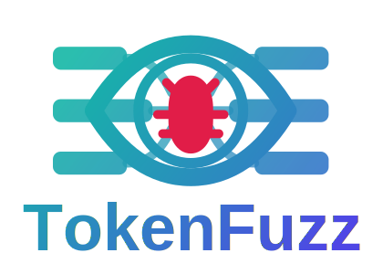

  

TokenFuzz is an open platform for LLM-based vulnerability research: a
coordinated fleet of agents that audits a codebase, finds security issues, and
hands each one back with the evidence and reasoning a developer needs to
triage it. Point it at any source tree you are authorized to test —
C/C++, Rust, Go, Python, Java, and more, including browsers — and it runs
as a pipeline:

- **Recon sweep.** A cold-start pass runs a CTF-style "find all
  vulnerabilities" survey, split across parallel agents over
  directory-coherent, LOC-balanced slices of the source. On a large
  codebase it scopes to recently-changed code so the pass stays
  bounded. Results land in a prioritized queue.
- **Eight investigation strategies.** Deep agents work that queue with
  prior-fix mining, invariant negation, spec-vs-implementation,
  differential testing, lifetime and state, cross-project peer-fix
  mining, parser-input engineering, and property oracles — across Claude,
  Codex, Gemini, or a local Ollama model behind one probe-and-triage
  contract.
- **Reachability-labelled findings.** Every finding separates
  attacker-controlled-byte issues from internal caller-misuse and pure
  test- or maintenance-tool surface, so triage moves on signal instead of
  drowning in null-derefs, OOMs, and assertion-only aborts.
- **Cost as a first-class resource.** Prompt caching, capped state views,
  per-agent sanitizer-run budgets, soft turn caps, work-card leases, and
  SHA-pinned recon reuse keep unattended multi-agent runs affordable.
- **Fleet coordination.** Shared logging and cluster-level dedup keep
  parallel agents accumulating work rather than repeating each other; an
  independent validator pass with no shared context catches a model's own
  reasoning errors before anything is accepted.
- **Maintainer-ready handoff.** Every accepted crash exports as a bundle —
  sanitizer trace, reproducer testcase, one-command `reproduce.sh`,
  candidate fix direction, and optional `patch.diff` — that rebuilds
  against a clean upstream checkout.

The platform does the discovery, the analysis, the triage, and the
handoff; the final security judgment stays with you.

## Documentation

Read the [detailed documentation](https://tokenfuzz.github.io/tokenfuzz/) to
learn how to use TokenFuzz.
