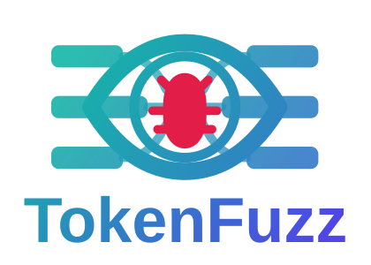

  

TokenFuzz is an open-source harness for evidence-driven, LLM-assisted security
auditing. It coordinates agents that read source, form concrete hypotheses,
run testcases, and turn validated results into reports a maintainer can act
on. It works with C/C++, Rust, Go, Python, Java, and other supported
languages, from native libraries and command-line tools to browsers and
JavaScript runtimes.

A prompt alone does not make a long audit reliable. The harness adds the parts
that do:

- **Source-to-testcase investigation.** Deterministic ranking builds a shared
  work queue, and eight review strategies direct the analysis without needing
  a known bug or a crashing seed.
- **Evidence-gated results.** Every testcase runs through one probe contract.
  Sanitizer diagnostics are confirmed before promotion, and concrete
  non-crashing security issues are first-class findings.
- **Fleet coordination.** Work leases, structured state, and clustering let
  parallel agents resume investigations without rediscovering the same root
  cause.
- **Reviewable triage.** Independent validation, reachability and
  caller-control fields, rejected-result indexes, and severity annotation make
  a model's claim traceable instead of self-authenticating.
- **Measured review coverage.** Every auditable file is recorded, agents
  attest the lines they read, transcripts cross-check those receipts, and a
  report shows what the run never looked at. A clean result is not mistaken
  for a complete one.
- **Maintainer handoff.** Accepted crashes become self-contained bundles: a
  report, the input, the sanitizer output, and a one-command reproduction
  script for a clean checkout.
- **Comparable evaluation.** A built-in benchmark runs TokenFuzz and a direct
  vulnerability prompt under matched target, model, and wall-clock budgets,
  then compares validated, deduplicated evidence rather than prose volume.
  See an [example result page](https://tokenfuzz.github.io/tokenfuzz/assets/examples/benchmark-sample-c/benchmark-result.html)
  from a run against the C sample.

It drives Claude Code, Codex CLI, Gemini through Antigravity or the Google
Gemini CLI, Grok Build, and local models through OpenCode; `--backend all`
rotates the hosted ones across iterations. Hosted and local model backends use
the same audit contract. Bounded source reads, prompt reuse, execution budgets,
and resumable state keep long runs operationally manageable. Final security
judgment remains with the operator and the upstream maintainer.

## Documentation

Read the [documentation](https://tokenfuzz.github.io/tokenfuzz/) for
installation, a first audit, target configuration, result triage, architecture,
benchmarking, and development.

Only test software you are authorised to assess, and report target findings
through the upstream project's security process.
