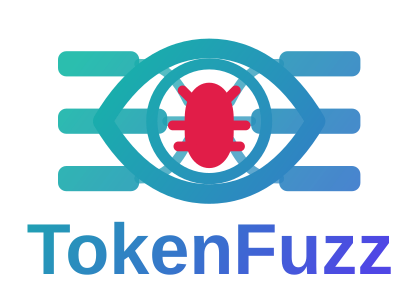

<p align="center">
  
</p>

TokenFuzz is an open-source harness for evidence-driven, LLM-assisted security
auditing. It runs coding agents against a source tree you are authorised to
test. The agents read code, record concrete hypotheses, run testcases, and
file what they find. The harness checks that evidence, and what survives
review becomes a report a maintainer can act on.

It works with C/C++, Rust, Go, Swift, Python, Java, and other languages, from
native libraries and command-line tools to browsers and JavaScript runtimes.

A prompt alone does not make a long audit reliable. The harness adds the parts
that do:

- **Source-to-testcase investigation.** A deterministic ranker builds a shared
  work queue, and eight review strategies steer the analysis. No known bug or
  crashing seed is needed.
- **Evidence-gated results.** Every testcase runs through one probe command.
  A sanitizer crash must reproduce before it is promoted, and a concrete
  security issue that never crashes is still filed as a finding.
- **Fleet coordination.** Work leases, structured state, and clustering let
  parallel agents pick up each other's work instead of rediscovering the same
  root cause.
- **Reviewable triage.** Independent validation, reachability and
  caller-control fields, indexes of rejected results, and severity annotation
  make each model claim traceable rather than self-certifying.
- **Measured review coverage.** The run records every auditable file, agents
  attest the lines they read, their transcripts cross-check those receipts,
  and a report lists what the run never looked at. A clean result is not
  mistaken for a complete one.
- **Maintainer handoff.** Each accepted crash becomes a self-contained bundle:
  a report, the input, the sanitizer output, and a one-command script that
  reproduces it on a clean checkout.
- **Comparable evaluation.** A built-in benchmark runs TokenFuzz and a direct
  vulnerability prompt with the same target, model, and wall-clock budget,
  then compares validated, deduplicated evidence rather than volume of prose.
  See an [example result page](https://tokenfuzz.github.io/tokenfuzz/assets/examples/benchmark-sample-c/benchmark-result.html)
  from a run against the C sample.

TokenFuzz drives Claude Code, Codex CLI, Gemini (through the Antigravity CLI
or Google Gemini CLI), Grok Build, and OpenCode with either a catalog
provider or a local OpenAI-compatible endpoint. Claude Code and Codex CLI run
inside their own OS sandbox by default; Gemini, Grok, and OpenCode need a
container or VM you administer. `--backend all` rotates the installed hosted
backends that the chosen isolation mode can launch. Every backend runs the
same audit contract, and bounded source reads, prompt reuse, execution
budgets, and resumable state keep long runs manageable. Final security
judgment stays with you and the upstream maintainer.

## Quick start

```bash
git clone https://github.com/tokenfuzz/tokenfuzz
cd tokenfuzz
bash tests/run-tests.sh

# A one-worker smoke test against a shipped synthetic target.
bin/audit --target samples/sample-python --backend <backend> 1
```

[Prerequisites](https://tokenfuzz.github.io/tokenfuzz/getting-started/prerequisites/)
lists the host tools and backend CLIs.
[Add a target](https://tokenfuzz.github.io/tokenfuzz/getting-started/add-a-target/)
and [First audit](https://tokenfuzz.github.io/tokenfuzz/getting-started/first-audit/)
walk through auditing your own project.

## Documentation

The [handbook](https://tokenfuzz.github.io/tokenfuzz/) covers installation, a
first audit, target configuration, result triage, architecture,
benchmarking, and development.

Only test software you are authorised to assess, and report target findings
through the upstream project's security process.
