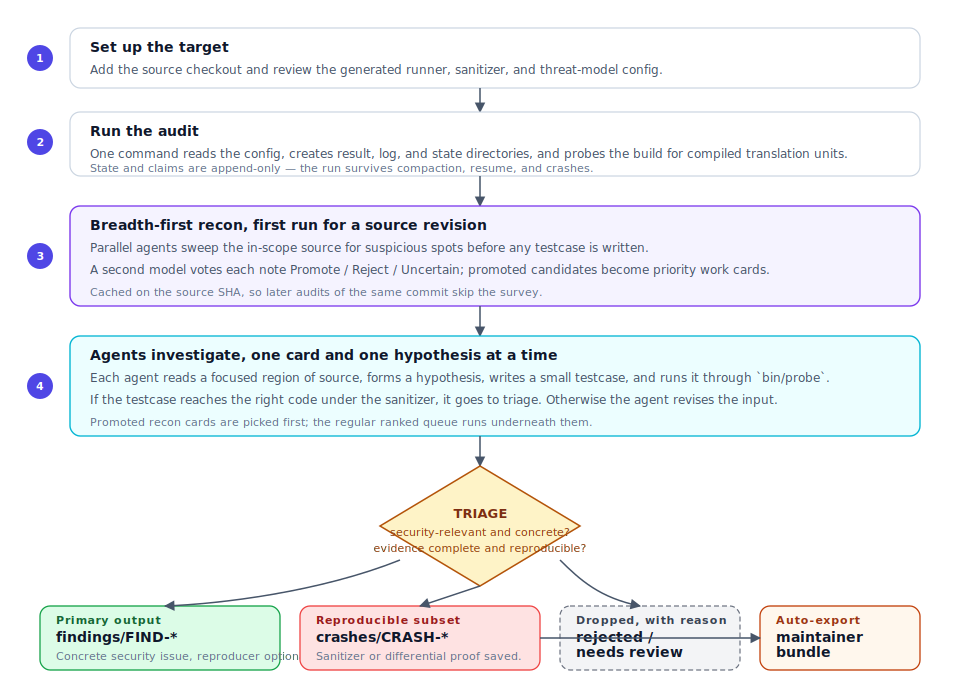

# Audit Lifecycle

[](../assets/audit-lifecycle.svg){target="_blank" title="Open full-size diagram in a new tab"}

This page follows a run from "I have source I'm allowed to audit" to
"a reviewer is looking at a finding". Every other page in the handbook
expands on one piece of it.

A run has two successful endings:

- **A written finding.** Any concrete security issue lands in
  `findings/` as a substantive report a reviewer must manually
  verify. With or without a reproducer. This is the primary surface.
- **A runnable crash.** When the testcase reproduces under a
  sanitizer, the same issue also lands in `crashes/` with the trace,
  the input, and a ready-to-run `reproduce.sh`.

Every accepted crash is automatically converted to a maintainer bundle
(`REPORT.md` + `reproduce.sh` + sanitizer output + the input) as part
of triage; you do not have to run any extra step to get that.

## 1. Set up the target

Setup creates two things:

```text
targets/<target>/                   upstream source + sanitizer build
output/<target>/target.toml         generated config + threat model
```

The source checkout belongs to the upstream project. The harness
reads it, builds against it, and records its revision, but audit
output stays under `output/`.

If `target.toml` is missing, `bin/audit --target <slug>` seeds a
starter config automatically before loading it. You can also seed or
refresh it explicitly with `bin/setup-target <slug>` (or use
`bin/audit --new-target <slug>` to generate the file and exit).

## 2. Build the sanitizer artifact

For native C/C++ targets, the harness needs a sanitizer build. The default
location is `targets/<target>/build-asan/`, and `target.toml` points
the harness at the binary inside it (`asan_bin`, `asan_lib`). The same
layout is used for browsers and generic CLI/library targets.

- ASan is the only sanitizer enabled by default.
- UBSan, MSan, TSan, and Go's race detector are opt-in per target.
- MSan is recommended for self-contained libraries.
- UBSan and TSan are useful but need triage of their false positives.

See
[Configure a target](../guides/configure-target.md#sanitizer-policy)
for the recommended posture.

Targets with `[sanitizer].enabled = []` (typical for interpreted
runtimes like Python, Ruby, Node, Java, PHP, but valid for anything
without an ASan build) skip the sanitizer entirely and run in
findings-only mode — runtime panics and tracebacks land under
`findings/` instead of `crashes/`. Go is a hybrid: when
`[sanitizer].enabled = ["race"]` and `[runner].args` includes
`-race`, the runtime race detector still routes data-race reports
into `crashes/`.

Audit preflight can create or refresh ordinary non-browser native sanitizer
builds. Browser builds use their project tooling; registered language package
builds run explicitly through `bin/setup-target <target> --build`. After the
required build exists, refresh the generated config and review only unresolved
or incorrect values.

For ordinary native targets, the regular `build-asan` remains the control and a
cached widened ASan sibling explores compatible optional in-tree features. With
multiple reproducer agents, the harness assigns alternates only to a minority
slot; with one agent, it assigns about one closed-work iteration in four to an
alternate. A confirmed alternate-build crash is automatically replayed five
times on the primary build. Triage records whether the same fault reproduces
there and keeps ordinary trigger review enabled when it does not. This spends extra build time
once without allowing broader configuration coverage to erase bugs specific to
the project's regular configuration. Automatic preflight limits that extra work
to ten minutes total and falls open to the primary; explicit build preparation
can run longer when a large target needs it.

## 3. Run the audit

`bin/audit --target <slug> --backend <backend>` starts a session. It
reads `target.toml`, detects the source revision, creates per-backend
result and log directories, and launches one or more agents. The
optional iteration count limits the run; omit it (or pass `0`) to run
continuously.

Each agent is assigned a role and a strategy. Subsystem and starting
point come from the work queue when the agent claims its first piece
of source. Claims, hypotheses, notes, and probe verdicts are written
as append-only rows under `state/`. That structured state — not the
agent's transcript — is the source of truth across resume, compaction,
and crash recovery.

## 4. Breadth-first recon (cold start only)

On a multi-iteration run, the first time `bin/audit` sees a given target
revision it pauses before the deep agents and runs a **breadth-first recon
pass**. (A one-iteration smoke test skips recon.) Several agents sweep the
in-scope source set for suspicious
spots (no sanitizer, no testcases), and a second model votes each
emission Promote / Reject / Uncertain. The result is a prioritized
list of *where bugs might be* — work cards the deep agents pick up
first, not a verified bug list.

Promoted recon cards get the strongest priority: if no agent is
already on one, the next eligible claim is steered there even when
the agent's current strategy filter would normally skip it. Rejected
candidates are demoted rather than deleted, so a later sanitizer
verdict can still overturn the validator.

Recon uses a bounded per-agent time budget and is cached on the target source
SHA, so later audits against the same revision skip it. If recon fails, the audit
continues on its regular ranked queue. See
[Recon discovery](../guides/recon-discovery.md) for the full picture.

## 5. Agents investigate

Each agent works on **one hypothesis at a time**:

1. Take an assigned piece of source from the work queue.
2. Pick or refine a hypothesis (a file, a function, a line, an input
   shape, an expected diagnostic).
3. Read a small region of the source.
4. Find an existing seed input, or write a testcase from scratch.
5. Run the testcase. If it doesn't reach the right code through the
   configured sanitizer or runner, revise the input and try again.
6. If it does, confirm the result and move it through triage.

Investigation depth follows evidence. A deterministic hypothesis can close
after one clean probe only when the testcase directly exercised its exact
trigger. Allocator-, scheduler-, race-, GC-, timing-, re-entrancy-, and
state-dependent triggers need repetition or distinct inputs. Before a whole
work card is discarded, the harness requires three card-linked clean probe
runs across two distinct hypothesis shapes that were actually probed. This
preserves breadth without charging every cold hypothesis for several variants.
If no configured build or mode can execute the surface, the agent records an
ENV-BLOCKED hypothesis instead; that soft-blocks the card for the current
result set without pretending that MISSED probes were clean evidence. Proven
mode-incompatible, stale, or non-public cards use the same soft `blocked` exit.

Work cards are leased so two agents don't step on each other; after a context
compaction, the next iteration tells the agent which regions it has already
read so it doesn't re-cover the same ground.

When an agent confirms a crash or finding in a subsystem, the queue
relaxes the usual subsystem-diversity rule for that agent.
Neighbouring cards are cheaper and more valuable once the agent has
working data-flow context for the area.

## 6. Run the testcase

Every testcase runs through one execution gate: `bin/probe`. It reads
the testcase header, picks the right runner (browser, JS shell,
generic CLI, C/C++ or language harness, differential, or the
configured `[runner]`), captures output, and records the verdict in
`state/runs.jsonl`.

Common outcomes:

| Outcome | Meaning | Action |
| --- | --- | --- |
| Did not execute | Syntax error, missing binary, runner refused. | Fix the testcase. This doesn't count against the sanitizer budget. |
| Missed the target code (browser/JS only) | A coverage-gated probe didn't reach the named function. | Revise the input. |
| Clean hit | The code ran but the sanitizer was quiet. | Mutate input shape, state, timing, or allocator layout. |
| Sanitizer diagnostic | The input might be a crash candidate. | Confirm by re-running, minimise, and file under `crashes/`. |
| Differential divergence (JS only) | Two JS modes disagreed on output. | Save both outputs and file as a finding — no sanitizer crash needed. |

Coverage gating only fires in browser and JS modes. Generic CLI
targets always run the sanitizer directly.

Probe output is a contract, not a log. Crash promotion requires a
saved sanitizer or differential output file; report-only FINDs go
through FIND validation instead.

## 7. Triage

Triage decides whether an artifact is useful and in scope.

**For crashes, the gates are strict:**

- there is a runnable testcase;
- sanitizer or differential output is saved;
- the report fields are complete;
- the result is not an auto-quarantined low-value class — null
  dereference (`0x0` SEGV), OOM, assertion-only abort (ABRT with no
  sanitizer error), `MOZ_CRASH`/panic, timeout-only, or a plain
  stack overflow.

A trigger source outside the target's declared attacker surface is
*not* a rejection: the crash stays in `crashes/` with a contract
concern noted. The scorer represents that local precondition with
CVSS-BTE Environmental **MAT:P**, because the threat-model fit is a
scoring question, not a filing question.

Crash class, artifact completeness, harness ownership, and contract fields are
checked deterministically. A final source-reading trigger-provenance gate is
recall-safe: it needs two independent Reject votes with concrete disproof to
remove a sanitizer-confirmed crash. An unavailable or inconclusive reviewer
keeps the crash.

**For findings, the gates are about substance:**

- there is a report file at the FIND root;
- the report is substantive — a concrete location, an explicit issue
  class, and a rationale a reviewer can act on. A sanitizer
  reproducer is *not* required.

Because no sanitizer vouches for a finding, an independent LLM
substance gate reads each report with no shared context and votes it
accept or reject. Two accepts promote the finding; two rejects
quarantine it to `findings-rejected/`. An accepted finding then gets
one source-reading trigger-provenance review
(`bin/validate-finding --gate trigger`) that can demote it only with a
concrete disproof.

What happens to each artifact:

- Accepted crashes stay under `crashes/`.
- Hard rejections move to `crashes-rejected/` with a reason rendered in
  `REJECTED-CRASHES.html`.
- Runtime-diagnostic crashes from findings-only targets are demoted
  to `findings/` rather than promoted as sanitizer crashes.
- Findings with no report get a `.needs-content` marker and surface
  as `NEEDS CONTENT` in `findings/FINDING-CLUSTERS.html`.
- Findings rejected twice by the substance gate are quarantined to
  `findings-rejected/` — they are not deleted, so you can review the
  reasoning.

Severity annotation is best-effort post-processing. A failed scoring
run does not remove an otherwise complete crash or finding.

## 8. Export to a maintainer bundle

Triage automatically runs `bin/export-repro` on every accepted crash.
After bundling, each `crashes/CRASH-*` directory contains:

```text
REPORT.md          one-page summary
REPORT.html        generated sibling
reproduce.sh       single command, no env vars
input.<ext>        the testcase bytes
harness.{c,cc,cpp,cxx} present iff the bug uses a C/C++ harness
sanitizer.txt      full sanitizer output
patch.diff         optional candidate fix
severity.json      records that the report was scored
.audit/            original agent-authored files, kept for provenance
```

A maintainer runs:

```bash
./reproduce.sh /path/to/source
```

and sees the same sanitizer output against a clean checkout. You can
re-run `bin/export-repro <crash-id> --slug <target>` manually after
editing files in the bundle, but the first export happens during
triage without operator action.

## 9. Where to look

The paths worth knowing during a session:

```text
output/<target>/CRASH-CLUSTERS.html
output/<target>/FINDING-CLUSTERS.html
output/<target>/<backend>/results/crashes/
output/<target>/<backend>/results/findings/
output/<target>/<backend>/results/crashes-rejected/REJECTED-CRASHES.html
```

See [Artifact layout](../reference/artifacts.md) and
[Commands](../reference/commands.md) for the full inspection toolkit.
