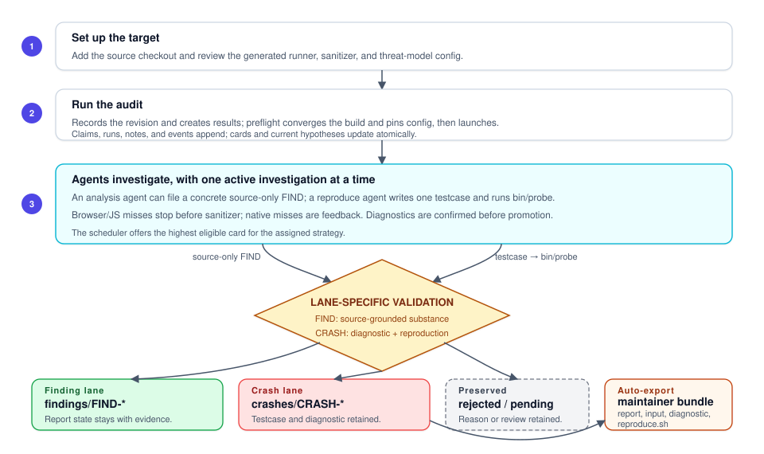

# Audit lifecycle

[](../assets/audit-lifecycle.svg){target="_blank" title="Open full-size diagram in a new tab"}

This page follows a run from "I have source I'm allowed to audit" to "a
reviewer is looking at evidence". The other concept pages explain the
individual components; this one tells the end-to-end story. In its shortest
form:

```bash
bin/setup-target <target> <repo-url-or-path>
bin/audit --target <target> --backend <backend>
```

A useful run ends in one of two evidence lanes:

- **A written finding.** A concrete security issue that does not need a
  sanitizer crash lands in `findings/` as a report for independent review. A
  reproducer helps, but is optional.
- **A confirmed crash.** A testcase that reproduces under a configured
  sanitizer or race detector lands in `crashes/` with the trace, the input,
  and a `reproduce.sh` that rebuilds and re-runs it.

The lanes are parallel, not a ladder. A managed-runtime panic or traceback
can support a finding, but it is never a crash; sanitizer and race
diagnostics must meet the crash lane's confirmation and review bar. Every
crash that passes the mechanical checks is exported as a maintainer bundle
during triage, with no extra step.

## 1. Set up the target

`bin/setup-target` creates two things:

```text
targets/<target>/                   upstream source checkout
output/<target>/target.toml         generated config + threat model
```

The checkout belongs to the upstream project. The harness reads it, builds
against it, and records its revision, but audit output stays under
`output/`. Review the generated runner, sanitizer, and threat-model values
before the first audit; see
[Target configuration](../guides/configure-target.md).

If `target.toml` is missing, `bin/audit` seeds a starter config. That seed
is deterministic: unlike setup, it asks no model for a threat model or peer
projects.

## 2. Build the sanitizer artifact

Native C/C++ targets need a sanitizer build. Plain setup normally does not
build: either run `bin/setup-target <target> --build`, or let audit
preflight build or refresh a missing or stale tree before any agent starts.
`target.toml` points the harness at the binary and library inside it
(`asan_bin`, `asan_lib`).

Preflight covers every build system with a clean recipe, browser drivers
included. It does not bootstrap a language package build: run
`bin/setup-target <target> --build` once for those, and preflight keeps the
recipe fresh from then on. Once a build exists,
[refresh the generated config](../guides/configure-target.md#review-the-execution-route)
and review only the values still unresolved or wrong.

Which detector runs depends on the target:

| Target | Sanitizers enabled by setup | Where diagnostics go |
| --- | --- | --- |
| C/C++ | ASan; UBSan, MSan, and TSan are opt-in | `crashes/` |
| Go | `race` | A `WARNING: DATA RACE` report goes to `crashes/`; panics are report evidence |
| Swift | ASan | `crashes/` |
| Most other languages | none (`[sanitizer].enabled = []`) | Findings only; runtime panics and tracebacks are report evidence |

[Sanitizer policy](../guides/configure-target.md#sanitizer-policy) has the
recommended posture.

For ordinary native targets, the regular sanitizer build stays the control,
and one **widened** sibling turns on compatible optional features: a bug
behind a non-default feature is still a bug. One reproduce slot rotates onto
the alternate builds. A crash found there is replayed against the regular
build and triaged with both results. Set `build_widening = false` in
`target.toml` to skip this work. Browser targets get no widened build.

## 3. Run the audit

`bin/audit --target <target> --backend <backend>` starts a session. An
optional iteration count bounds the run: omit it (or pass `0`) to run
continuously, or pass `1` for a one-worker smoke test. Startup runs in a
fixed order:

1. **Prepare the results tree.** Load `target.toml`, record the source
   revision, and create the result and log directories and one scratch
   directory per agent.
2. **Preflight.** Take the one-instance lock, validate the runner route,
   prove with a short launch that the model can act in the target tree,
   converge the build, and pin the configuration.
3. **Initialize.** Reconcile stale review verdicts, refresh the ranked
   queue, and give each agent a strategy.
4. **Launch.** Start the budgeted sweep, if one is configured, then the
   agent slots.

The pinned configuration is a copy of the reviewed `target.toml` inside the
result tree, and it cannot change during the run: edit the source config for
the next session instead.

The pool is three workers by default. With more than one agent, the last is
an `analysis` agent that traces source and hands concrete leads to the
others; the rest are `reproduce` agents. Each agent also works one strategy
and claims work cards from the ranked queue. See
[Environment variables](../reference/environment.md#worker-pool) for the
pool size and [Strategy model](strategy-model.md) for how work is assigned.

Claims, hypotheses, probe verdicts, notes, and events are all recorded as
structured state under `state/`. That state, not an agent's transcript, is
the source of truth across resume, context compaction, and crash recovery.

### How slots are scheduled

An ordinary audit schedules continuously. A slot whose session ends
relaunches at once if it has work, so nothing waits for the slowest peer. A
session that hits its turn cap continues with fresh context and keeps its
claim; a failed session gets one retry. A slot idles until the next steward
tick when it has nothing to do, when its last session made no tool call, or
after two clean relaunches since the last tick.

The **steward tick** (every five minutes by default, `STEWARD_INTERVAL_SECS`)
steers without stopping anyone. It re-ranks the queue, releases stale
claims, and rotates strategy lanes that have run dry. Once at least one
session has ended since the last tick, it also scores that generation and
renews the per-iteration sanitizer and decision budgets. Each scored
generation is one iteration, and a numeric iteration count caps them.

Review runs beside the slots: a background gate judges each artifact as soon
as no live session is still writing it. The one full barrier is the final
pass after the last slot drains. It reuses the cached verdicts, judges what
the background gate could not reach, and runs the housekeeping that is
unsafe beside a live session, such as orphan-testcase checks, corpus
promotion, and index maintenance.

Pinned `--strategy` runs, delta runs, `--no-refill-workers` runs, and
multi-backend ensembles keep the older **cohort** model instead: launch a set
of sessions, wait for all of them, then run a full pass at the end of every
iteration.

??? note "When the background gate judges an artifact"
    - **A complete crash bundle** once no session can still be writing it:
      its filing slot has no session in flight (or started one after the
      bundle was complete), and every session whose commands or file writes
      named it has ended. A bundle also seals after five minutes with no
      writes under it, even while its owner runs, because sessions often run
      to the wall; a later edit invalidates the verdict and it is judged
      again. A `bin/probe` skeleton or a held bundle stays with its owner.
    - **A finding** once every session that named it has ended, or, when
      none named it, once every running session started after it was filed.
      Findings never seal on quiet time: an agent often files one and keeps
      probing, and moving it under a live writer would see it recreated as a
      second artifact. Findings are reviewed in small batches.

    A turn-capped session's continuation counts as the same session. A
    review call is not started with less wall time left than the fastest
    completed call of its kind took; it waits for the final pass instead of
    being cut off without a vote. Cluster expansion (asking the model for
    neighbours of a newly gated crash) runs on its own lane, so a slow
    decision cannot hold up gating.

### Delta audits

`bin/audit --since <rev>` runs a **delta audit** over `<rev>..HEAD`. Its
work cards cover only the changed files, the files that call them (one hop
over the call-neighbourhood graph; with no graph, the run says so and covers
the changed files alone), and one S1 card per commit in the range that
touches auditable source. The delta is the whole scope: no diversity floor,
no window expansion, no peer-project or fuzz-campaign cards, and no sweep.

Three rules keep that scope honest:

- The tracked working tree must match `HEAD`, because uncommitted code is
  outside the recorded range.
- A revision the checkout cannot resolve (a shallow clone, a typo) stops the
  run rather than silently widening it to a full audit. An empty or
  exhausted delta stops it too.
- A resumed delta run must keep the same `HEAD` and pass the same `--since`.

## 4. Agents investigate

Each agent keeps **one active investigation at a time** and parks other
candidate hypotheses in its compact state:

1. Take the assigned piece of source from the work queue.
2. Pick or refine a hypothesis: a file, function, line, input shape, and
   expected diagnostic.
3. Read a small region of the source.
4. If the source already establishes a concrete security issue, file the
   finding now; a reproducer strengthens it but is not required.
5. Otherwise find a seed or write one testcase and run it immediately. If it
   does not reach the right code, revise the input and try again.
6. Confirm a diagnostic before crash promotion, then let the artifact go
   through its lane's validation.

An analysis agent records leads that need a testcase as `NEEDS_TESTCASE`
hypotheses, and a reproduce agent picks them up. The budgeted sweep hands
off its leads the same way.

Investigation depth follows evidence. One clean probe that exercises every
named boundary can close a deterministic hypothesis, but timing-, race-,
allocator-, and state-dependent triggers need repetition or different input
shapes. Closing a hypothesis does not retire its card either: a dry card
needs a minimum of clean probes across distinct hypotheses before it can be
discarded, and a broad whole-file card stays reofferable even then (see [A
good hypothesis](strategy-model.md#a-good-hypothesis)). Code that no
configured build or mode can execute is marked blocked, never counted as
clean.

Work cards are leased, so two agents do not step on each other. An agent
records the line ranges or functions it read with `bin/state mark-examined`,
and every later pickup of the card, including one after a context
compaction, starts from the unexamined functions instead of re-reading the
file; see [Review coverage](coverage.md#receipts). An agent that confirms a
bug in a subsystem may keep taking neighbouring cards there until the area
goes dry, because its data-flow context makes them cheaper and more
valuable.

## 5. Run the testcase

Every testcase runs through one execution gate, `bin/probe`. It reads the
testcase header, picks the right runner (browser, JS shell, generic CLI,
C/C++ or language harness, or the configured `[runner]`), captures output,
and records the verdict in `state/runs.jsonl`.

The common outcomes (the [glossary](../reference/glossary.md) defines every
verdict):

| Outcome | Meaning | Action |
| --- | --- | --- |
| `NO_EXEC` | No target execution was established: the testcase is missing, the route was refused, a `go run` build failed, the diagnostic came from a binary `bin/probe` did not build, an empty input crashes the same way (`input-independent`), or the sanitizer launch budget is spent (`budget-exhausted`). | Fix the prerequisite, or wait for the next iteration. Never clean evidence, and never a reason to discard a hypothesis. |
| `EXEC_FAIL` | The command started but produced no valid result. The recorded class says why. | Fix what the class names: the route, the argv, the harness, or the input. The launch still counts against the sanitizer budget. |
| `TIMEOUT` | The runner hit its deadline. | Unresolved evidence, never a clean run. |
| Missed the target code | Coverage replay did not reach the named function. Browser and JS modes stop before the sanitizer; a native target still runs it and records the miss. | Revise the input around the closest reached frame. |
| Clean hit | The code ran and the sanitizer stayed quiet. | Mutate input shape, state, timing, or allocator layout. |
| Sanitizer diagnostic | A possible crash. | Re-run with `bin/probe --confirm`. A crash that reproduces is filed as a `crashes/CRASH-*` bundle by the probe itself, and the agent completes its report. |

Coverage comes from the target's coverage build. When a native target has
none, coverage is reported unavailable and the sanitizer run proceeds; an
unmeasured input is never counted as a miss. See
[Coverage replay](../reference/commands.md#coverage-replay).

Probe output is a contract, not a log: crash promotion requires the saved
sanitizer output on disk. The probe also refuses to file the same crash
state through the same route twice, while a materially different route or
build is still filed; see
[Deduplication](deduplication.md#filing-time-refusal).

## 6. Triage

Triage decides whether an artifact is useful and in scope. It runs in the
background while agents work and again in the final pass (see
[How slots are scheduled](#how-slots-are-scheduled)).
[Triage and review](../guides/triage-results.md) is the canonical description
of review stages, publication states, and rejection reasons; this section is
the overview.

**Crashes pass mechanical gates first.** A crash needs a runnable testcase
or harness, saved sanitizer output, and complete report fields; an
incomplete crash is held pending for a bounded number of passes, then
rejected. Low-value classes are rejected automatically: null dereference
(`0x0` SEGV), stack overflow, out-of-memory or allocation-size failures,
assertion or intentional-crash aborts, panics, and aborts with no sanitizer
error. A memory-safety class overrides all of these. A diagnostic with no
memory-safety class is demoted to `findings/`, where it needs a substantive
report. A fault rooted in the agent's own harness is rejected, and a
duplicate crash state folds into the crash it repeats (see
[Deduplication](deduplication.md)).

**Findings pass a substance gate.** A finding needs a report at the FIND
root with a concrete location, an explicit issue class, and a rationale a
reviewer can act on. A sanitizer reproducer is not required. Because no
sanitizer vouches for a finding, independent reviewers read each report
without the filing agent's context and vote: two accepts admit it, two
rejects move it to `findings-rejected/`.

**Both then get source review.** A reviewer reads the target source to check
that the attacker can reach the trigger and that the claimed consequence
holds. The bar for discarding evidence is deliberately high:

- A crash or finding is disproved only by two independent rejections that
  each carry a concrete disproof anchored in source. One Reject, even from a
  resolution review, is never enough.
- A trigger outside the target's declared attacker controls is rejected with
  a `threat-model:` reason.
- A split or inconclusive review gets a focused resolution pass. If the
  completed reviews still cannot place the trigger either way, the artifact
  is rejected as `unsettled-scope:`.
- Missing review output keeps an artifact pending for a later pass; it is
  never a verdict.

Evidence is never deleted. Rejected crashes move to `crashes-rejected/`,
listed in `rejected-crashes.html`, and rejected findings to
`findings-rejected/`, each with its reason. A rejected artifact earns no
CVSS score and no security yield. A finding with no report gets a
`.needs-content` marker and a `needs content` status in the finding index.
Severity scoring runs afterwards as best-effort annotation: a failed scoring
run never removes an otherwise complete result.

### Rejections are kept as reusable knowledge

Building a reproducer is the expensive half of an audit, so a disproof is
worth keeping. When a reviewer rejects an artifact because its triggering
state is not attacker-reachable, and cites verified source anchors, the
reason is recorded in `state/unreachable-routes.jsonl`. Later work cards on
any file the disproof names show it, newest first, so later sessions do not
re-derive the same dead route.

A threat-model rejection, the commonest kind, records a row too, shown
under its own heading: the defect was real, but its trigger was out of
scope. Rejections for caller-contract misuse, a defect at no security
boundary, or a disproved consequence record nothing, because they say
nothing about which triggers the attacker reaches.

Two properties keep the note honest:

- **It rules out a route, not a file.** The card is still assigned, and
  reaching the same code through a different attacker-controlled path still
  counts.
- **It lives exactly as long as the rejection does.** A cached verdict is
  reused only while the report, threat model, configuration, recorded
  revision, and every cited source line are unchanged. When any of them
  changes, the artifact is requeued and its route note retired. Each run
  reconciles stale verdicts before its first agents launch, so an obsolete
  note never reaches a new run's work cards.

## 7. Export to a maintainer bundle

Triage runs `bin/export-repro` on every crash that passes the mechanical
checks, before source review, and a crash cannot be accepted until its
bundle is complete. Each `crashes/CRASH-*` directory then holds at least:

```text
report.md          one-page summary
reproduce.sh       ./reproduce.sh /path/to/source
input.<ext>        the testcase bytes (plus harness.<ext> when one is used)
sanitizer.txt      saved sanitizer output
validation.json    the publication decision, bound to this evidence
```

[Artifact layout](../reference/artifacts.md#crash-directory) lists the
optional files. A maintainer runs `reproduce.sh` against a checkout and
compares the new diagnostic with the saved `sanitizer.txt`; reproduction can
depend on the recorded revision, toolchain, configuration, and runtime
conditions. [Maintenance commands](../guides/triage-results.md#maintenance-commands)
shows how to re-export after editing a bundle.

## 8. Where to look

The paths worth knowing during a session:

```text
output/<target>/crash-clusters.html
output/<target>/finding-clusters.html
output/<target>/<backend>/results/crashes/
output/<target>/<backend>/results/findings/
output/<target>/<backend>/results/crashes-rejected/rejected-crashes.html
```

Before you trust a clean result, run
`bin/state --results-dir output/<target>/<backend>/results coverage` to see
how much of the tree the run reached; see [Review coverage](coverage.md).
[Artifact layout](../reference/artifacts.md) and
[Commands](../reference/commands.md) cover the full inspection toolkit.
