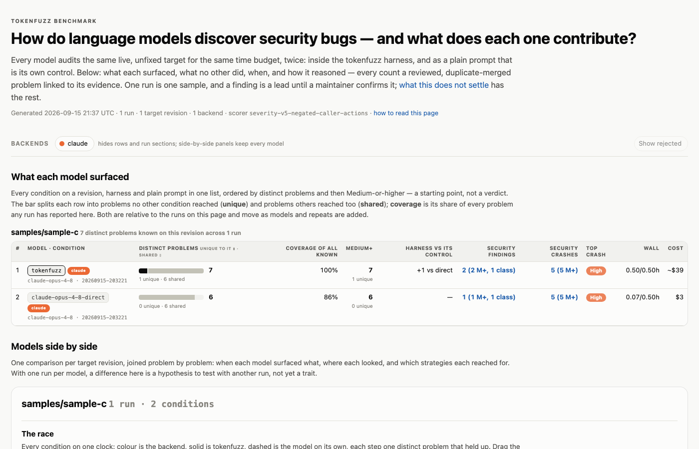
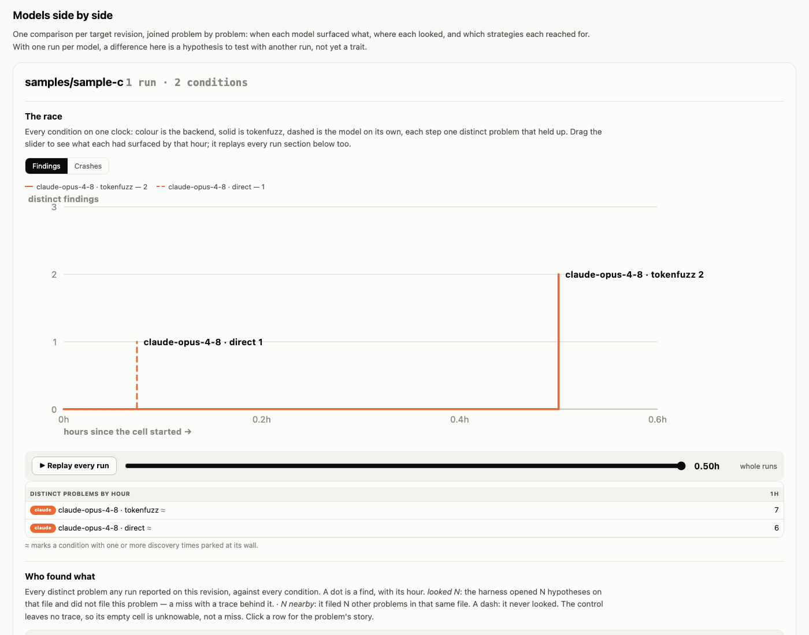

# Benchmarking TokenFuzz

`bin/benchmark` compares TokenFuzz with a direct model prompt on the same
target, backend, model, and wall-clock budget. Both conditions are scored
through the same validation and clustering pipeline.

The question is whether the harness earns its overhead: does its
coordination, execution, and review produce stronger validated evidence
within the same budget? That is useful to a security lead comparing
approaches or a contributor checking a harness change. For routine target
work, use `bin/audit`.

!!! example "See a finished result"
    [](../assets/examples/benchmark-sample-c/benchmark-result.html)

    The handbook ships a finished
    [example result page](../assets/examples/benchmark-sample-c/benchmark-result.html)
    from a run against the C sample, with every count link opening the
    evidence behind it. [Example result](#example-result) has the command
    that produced it and what to look for.

This page has three reading paths:

- **Run an experiment:** start with [Quick start](#quick-start), then read
  [resumption](#resuming-an-interrupted-run) before continuing an old run.
- **Assess the result:** read [How a result is counted](#how-a-result-is-counted)
  and [Reading the ledger](#reading-the-ledger).
- **Maintain saved results:** use
  [Regenerating results](#regenerating-results-after-code-changes).

A reported count represents reviewed evidence signatures. It is not a count
of independently proven root causes, and it is not a precision or recall
measurement without an answer key.

## The experiment

Each benchmark run is a small controlled experiment:

| Condition token | Rendered label | What runs |
| --- | --- | --- |
| `model-direct` | `<model>-direct` when the model is known, otherwise `<backend>-direct` | One launch of the backend CLI at its defaults with a bare vulnerability-hunting prompt. This is the control. It may delegate internally if the CLI does by default; how often is recorded as `delegation_events`. |
| `harness` | `tokenfuzz` | `bin/audit` as shipped: ranked work cards, strategy rotation, `bin/probe`, triage, validation, clustering, severity scoring, and reproducer bundling. |

Each cell isolates the backend from any instruction files, plugins, or
skills you have installed, using whatever per-run control that CLI provides.
This keeps an operator-installed security workflow from duplicating
TokenFuzz's own orchestration or contaminating the model-direct control.
Antigravity turns skill expansion off but has no plugin or memory switch, and
Grok Build turns memory off but has no plugin or skill switch, so disable
their installed plugins by hand before using them for benchmark claims. The
per-backend detail is in the
[backends guide](../guides/backends.md#one-isolation-policy-for-every-launch).

The `--conditions` flag always uses the stable tokens `model-direct` and
`harness`. The rendered labels are reader-facing names; they can include the
selected model so old and new model runs do not blur together.

Every cell gets the same per-cell wall-clock budget. With the defaults,
`bin/benchmark --target <target>` runs three `model-direct` cells and three
`harness` cells, each with a 10,800 second budget: six cells, about 18 hours
of audit time if run serially, plus a final validation pass that is
measurement, not audit time (see [The closing pass](#the-closing-pass)).

Both conditions are told when their budget ends (the direct prompt names a
UTC deadline and a `date -u` command to check it against), but by default
nothing re-enters a finished session to hold it there. A baseline driven back
to work by the runner measures the runner as well as the model, so the
Scoreboard reports what each condition spent of what it was granted. Some
models stop within minutes on a small target while others run to the wall,
which makes the default an unequal-spend comparison. `--hold-direct` runs the
equal-spend variant: a direct session that ends with more than a minute of
budget left is re-entered with the same prompt, told what it already filed,
until the wall. Its rows are labelled `<model>-direct-held` and the number of
re-entries is recorded on the cell's usage row, so the two experiments never
share a label.

The benchmark keeps normal audit output separate. Cells run under isolated
`bin/audit --experiment` trees, then the benchmark pools and scores their
evidence under `output/benchmark/`.

## Why it is not a stopwatch

A useful benchmark is not "which row printed the largest number".

The direct prompt can produce more raw crash directories because it has
little structure around API misuse, duplicates, or self-inflicted testcases.
TokenFuzz spends budget on work the direct prompt does not do: queue
construction, coverage-gated probes, validation, deduplication, severity
scoring, and maintainer-ready reproducers.

That overhead is part of the comparison. The question is whether the extra
machinery buys stronger evidence by the end of the same budget. Read the
severity and uniqueness columns before the raw counts.

Equal wall time does not mean equal worker capacity. `model-direct` is one
launch of the CLI at its defaults, which may delegate internally
(`delegation_events` records how often, and the Efficiency table marks such
conditions `≤`). The harness uses its configured worker pool, normally three
workers unless overridden. It is not sized automatically to the machine. The
scoreboard keeps the wall comparison visible and separately reports
occupancy, worker-hours, confirmed results per seat-hour, tokens, and cost,
so that concurrency is not mistaken for free efficiency.

## Quick start

```bash
bin/benchmark --target <target>
```

The target must already exist under `targets/<target>/` and have a usable
`output/<target>/target.toml`. A target slug may be nested, such as
`samples/sample-python`, which maps to `targets/samples/sample-python/` and
`output/samples/sample-python/`. If you have not created that yet, start
with [Add a target](../getting-started/add-a-target.md). A comma-separated
`--target` list runs the full replicate and condition grid once per target.

With all defaults, the command means:

| Setting | Default | Meaning |
| --- | --- | --- |
| `--backend` | `codex` | Agent backend. Valid values are `claude`, `codex`, `gemini`, `grok`, and `oss`. |
| `--model` | backend config default | Optional model override used by both conditions. |
| `--replicates` | `3` | Runs per condition. |
| `--budget-wall` | `10800` | Active audit seconds per cell, including housekeeping. Provider-recovery pauses are excluded. `0` is unlimited. |
| `--finalize-wall` | `0` | Wall-clock ceiling per final validation phase; crash triage and the finding drain each get a fresh one. A finding group admitted before the ceiling finishes its review; crash review stops at the deadline and may leave a candidate pending. `0` is unlimited. |
| `--finalize-workers` | `4` | Concurrent reviewers per final validation phase, for crash triage and the finding drain alike. Independent of `--agents`. It also scales the finding gate's admission groups, so raising it shortens the closing pass but coarsens where a finite `--finalize-wall` can stop admitting groups. |
| `--agents` | the audit's configured pool, normally `3` | Harness workers per cell. The direct baseline is always one launch. |
| `--conditions` | `model-direct,harness` | Run both the direct baseline and TokenFuzz. |
| `--hold-direct` | off | Re-enter a direct session that ends with more than a minute of budget left, until the wall. Rows are labelled `<model>-direct-held`. |
| `--bench-root` | `benchmark` | Shared benchmark artifact root. A relative path lives under `output/` in the repository root; an absolute path is used as given. |
| `--run-id` | UTC timestamp | Run directory under `output/benchmark/<backend>/`; reuse it to resume. |
| `--dry-run` | off | Plan the cells and write run metadata without launching any backend. |

Run `bin/benchmark --help` for the full option list.

A relative `--bench-root` must stay under `output/`; pass an absolute path to
use a tree elsewhere. `bin/export-benchmark` follows the same rule.

## What a run looks like

The commands below run the same target through three hosted backends, two
replicates per condition, at the default 3-hour cell budget:

```bash
bin/benchmark --target <target> --backend claude --replicates 2 --budget-wall 10800
bin/benchmark --target <target> --backend gemini --replicates 2 --budget-wall 10800 --agent-security external-bypass
bin/benchmark --target <target> --backend grok   --replicates 2 --budget-wall 10800 --agent-security external-bypass
```

The Gemini and Grok rows need `--agent-security external-bypass` because the
default mode refuses those backends, and they must run inside an environment
you hardened. A row measured under a different mode is not comparable to the
others (see [agent security modes](../guides/backends.md#agent-security-modes)).

The target has to be bootstrapped first: source in `targets/<target>/`, build
artifacts where the config says they are, and `output/<target>/target.toml`
reviewed. The shortest path is the
[Add a target](../getting-started/add-a-target.md) flow.

Treat a two-replicate, three-hour run as a layout and sanity check, not as a
statistical claim. LLM runs are stochastic. Five or more replicates across
more than one target is useful operational guidance for claims, not a formal
power calculation.

## How a result is counted

A benchmark row is only worth reading if both conditions were scored by the
same rule. This section is that rule. If you only want to run the thing,
skip to [Where results land](#where-results-land).

### The closing pass

When a cell's timed investigation stops, it triages its crashes and finishes
validating its findings before metrics are read. That pass is *measurement*,
not extra finding time: the artifact set is frozen when the audit wall ends,
so the closing pass cannot buy a cell another finding. Crash triage and the
finding drain each receive a fresh `--finalize-wall`, rather than sharing one
pool. The default value `0` is unlimited. With a finite value, finding
validation lets a bounded group admitted before expiry finish its allotted
review attempts; it does not invent a verdict when the response omits or
mangles an id. Crash triage passes the deadline through to its reviews, so a
review that does not settle in time can remain pending.

Crash triage and the finding drain each repeat until nothing is pending. A
pass that settles something, or that ran into a provider cap, is followed by
another — after the cap is waited out — because everything that can leave an
artifact pending inside a pass (a batch that omitted its id, a vote no model
served, a replay that could not run) is retried by the next pass from cached
receipts. A pass that settles nothing and records no cap stops the drain,
since repeating it would repeat its answers; so does a refusal. The log
names the stop. A remainder after the drain therefore means the finalize
wall expired, the provider refused, it stayed capped past the pause budget,
or a pass stalled — which is also how an outage that records no cap looks
(timeouts, a missing backend, a spent decision budget). `--regenerate`
continues from the cached receipts.

Inside a pass, the bounded per-report budget for the scorer fields a finding
needs before it can be judged is spent only by verdicts the model returned
for that report. A capped or timed-out call, a batch reply that dropped the
id, or unusable JSON says nothing about the report, spends nothing, and is
bounded by the pass instead. After the batched asks the report is asked on
its own once; a report whose every verdict left its caller contract and
trigger source unplaced does not say where its boundary is, and is rejected
with that reason rather than held.

A run records the three gate prompt versions in effect when it started (the
trigger gate, its resolver, and the find-quality gate) and adjudicates every
cell, crash triage, and finalization under them. A bump to any one landing
mid-run would otherwise split a cell's votes across two versions and leave
the whole cell published as an unjudged remainder. A run recorded before one
of the keys existed keeps what it did record and takes the live value for the
rest. `--regenerate` deliberately does not pin, because re-scoring exists to
apply current policy to artifacts already on disk; it is the way to settle a
run whose verdicts predate a rule you have since changed.

### What happens to anything unsettled

Nothing is guessed at. An unvalidated finding does not enter the finding
total. A sanitizer-backed crash with unfinished validation stays a visible
crash candidate rather than receiving final credit or an assumed severity.

A cell that finished but still holds unjudged findings keeps its place and
its evidence. Its finding count carries the remainder, and a count whose
remainder outnumbers its verdicts is marked `≥`: read that as a lower bound
on the condition, not a yield to compare. `bin/benchmark --regenerate` retries
reviews that have no usable answer or need focused resolution; it removes the
mark only if those decisions settle.

A cell that could not produce a usable measurement at all (provider limit,
interruption before substantive evidence, failed post-processing) is marked
incomplete and kept out of the medians, though any evidence it did produce
is still reported as an observed count. A direct backend that terminates
*after* substantive evidence is instead retained and counted, carrying its
shorter actual wall and a replicate marker saying the count came from a
shorter experiment.

### The security-decision table

Every run report carries one compact table of review outcomes:

| Outcome | Meaning |
| --- | --- |
| **Report** | Settled: real security impact inside the declared attacker surface. The only outcome that enters security yield or receives a numeric severity. |
| **Not reportable** | Settled: a real engineering defect that crosses no security boundary, either an admitted contract violation or reviewers agreeing the trigger needs a control the threat model does not list. Preserved on disk, never presented as a security bug. |
| **Rejected** | The claim failed a gate or completed review could not establish its scope. Kept in the rejected tree; the reason distinguishes disproof, threat-model rejection, and `unsettled-scope`. |
| **Review unsettled** | Required review is incomplete or has no usable answer. No security credit; shown as an unjudged remainder. |

An `Uncertain` verdict or split review can receive focused resolution using
the prior rationales. While required output is missing, the artifact remains
pending and contributes to the unjudged remainder. When all required reviews
have answered but still cannot place the trigger inside the threat model,
triage rejects it with an `unsettled-scope:` reason. That terminal outcome is
not an unjudged remainder.

Review receipts bind decisions to the evidence they evaluated. Changed
substantive evidence requires fresh review. The linked crash and finding
indexes carry the detailed signatures and reasons.

### Scope is decided by reading source, not by the report

The scope half of that decision (is the trigger inside `attacker_controls`?)
is deliberately not taken from the report. A report's `Trigger source` is
written by whoever found the bug, and it errs in both directions: a driver
that exercises documented entry points reads as caller-driven even when
attacker bytes decide the fault, and an unreproduced claim reads as
byte-driven even when only a caller can reach it. Left uncorrected, that
penalises the condition that builds reproducers and rewards the one that
does not. The trigger-provenance reviewer reads the source and answers the
question itself, and its answer wins when the two disagree.

### Denial of service is not scored

A report whose only consequence is availability loss (CPU or memory
amplification, algorithmic or regex complexity, leaks, out-of-memory,
recursion depth, a fault that ends one request or process) is rejected by the
finding gate on both sides, without a vote when its class is in the `dos`
family and by the quality reviewer when the class hides it. Crash triage
already auto-rejects stack exhaustion and out-of-memory diagnostics. This is
an accepted limitation: the harness scores boundary-crossing primitives, and a
condition that can restate one quadratic loop at twenty sites must not be
able to outscore one that found a memory-safety bug. The rejected reports
stay on disk under `findings-rejected/` as engineering evidence.

### Both conditions face the same bar

The baseline's crashes are replayed through the target's normal invocation
before they count, so a diagnostic that does not reproduce is not counted as
a crash.

A replay that never *ran* is a different thing, and is not read as a
verdict: the crash keeps its place under `crashes/`, takes no verdict, and is
reported as an unadjudicated remainder. Broken replay infrastructure can
neither destroy a real crash nor credit an unproven one. The failure is
logged where the operator sees it.

On either side, a crash that `bin/probe --confirm` reproduced 5/5 through the
ordinary target binary, faulting in the target's own code on an
attacker-controlled input, skips the trigger review it would otherwise get:
the evidence already answers the question that review asks. Everything
weaker takes the normal review.

On either side, a reproducer tests the pinned build and nothing else. A
driver that `#include`s a target source file compiles a build of its own:
the unit may be one the pinned configuration never built, such as an optional
module the upstream default switches off, and a maintainer replaying against
the pinned artifacts cannot see the crash. Triage asks the compiler which
target units the driver compiled (`lib/build_scope.py`) and demotes such a
crash to a finding with that reason, where source review adjudicates it. The
harness condition never had that route, because `bin/probe` links only the
pinned build; the rule makes the direct condition's crashes comparable
rather than removing bugs from either side.

## Where results land

All benchmark state lives under one root:

```text
output/benchmark/
  benchmark-result.md
  benchmark-result.html
  <backend>/
    benchmark-results.md
    benchmark-results.html
    <run-id>/
      run.json
      report.json
      cells/
      pool/
```

`run.json` records the model, reasoning effort, and agent-security profile
actually passed to the CLI, so an archived run stays reproducible even if
your global backend settings later change.

One profile covers both conditions of a run, so a cell and its control always
face the same boundary, and `--regenerate` re-scores a run under the profile
that run recorded rather than today's default. Across backends the
boundaries differ, most visibly in egress (see
[agent security modes](../guides/backends.md#agent-security-modes)). Read a
cross-backend row as two products under their own boundaries, and compare
runs only against runs that recorded the same profile.

The root `benchmark-result.html` is the cross-backend comparison, described
under [Reading the result page](#reading-the-result-page). You can open it
while the run is going: it refreshes as cells finish, under a provisional
banner, and a cell contributes nothing to the counts until its own triage
and validation are done. The full pooled comparison (revalidation, bundling,
clustering) is computed once at the end. `benchmark-result.md` beside it is
the same scoreboard as a Markdown table, for terminals and diffs.

Each backend also keeps a ledger,
`output/benchmark/<backend>/benchmark-results.md`, with one section per run,
rendered beside it as HTML. A new run adds a section; resuming or
regenerating an existing run replaces that run's section instead of
appending a duplicate. The ledger is the append-only record that
`bin/export-benchmark` rebuilds and `--reset` archives; the result page
shows everything a section holds and more, so the run's console output names
only the result page.

Every pooled crash that survives triage is bundled under the run's
`pool/crashes/` tree with a `report.md`, a rendered `report.html`, and a
`reproduce.sh`.

Every cell is pinned to the same primary build. Alternate ASan builds are an
ordinary-audit feature, deliberately kept out of the benchmark so backends
and conditions are compared on one identical compiled surface.

To hand a finished run to someone else, `bin/export-benchmark` packages it
into a self-contained, path-scrubbed archive (`--format zip|tar|dir`), taking
the same `--backend` / `--target` / `--run-id` selectors as `bin/benchmark`.

## Reading the ledger

Each run section is ordered for review.

**Verdict** gives the strongest observed crash and which condition found it.
If no sanitizer-confirmed crash exists, it says so.

**Scoreboard** is the main comparison table:

| Column | Meaning |
| --- | --- |
| `Condition` | `tokenfuzz` or the direct baseline label. |
| `Replicates` | `done/total`. Replicates that recovered from a mid-run provider pause got their full budget and fold in unmarked. A `(Np)` suffix flags N provider-limited replicates excluded from the totals (a same-run-id re-run retries them). A `(Nt)` suffix flags N counted replicates whose backend exited early, so their share of the counts came from a shorter wall than the grant. |
| `Wall (h)` | Median hours a cell spent finding things, over the hours it was granted (`0.52/5.00h`). Every cell in a run is granted the same wall, but a condition is free to stop early, so read the counts beside a short numerator as the yield of a shorter experiment. The triage and validation that follow the audit are measurement, not finding work, so they are not counted. |
| `Unique rejected findings` | FIND reports the validator rejected, after clustering merges duplicates where evidence permits. `up to N` marks an upper bound. |
| `Security findings` | Distinct evidence-signature clusters of reportable non-crash security findings, shown as `N` clusters with the Medium-or-higher subset and class breadth. Every term uses unique clusters as its denominator, so duplicate reports cannot inflate class breadth, and breadth counts canonical [bug classes](../reference/bug-classes.md), so two spellings of one class cannot either. These remain separate descriptive axes rather than an arbitrary weighted score. Links to the finding cluster report. |
| `Unique rejected crashes` | Crash candidates triage rejected, after stack/signature clustering merges duplicates where evidence permits. `up to N` marks an upper bound. |
| `Unique security crashes` | Distinct reportable sanitizer-signature clusters with real sanitizer output on disk, shown `N (M M+)`: N clusters, M scored Medium or higher. The crash-cluster link includes reportable crashes at every numeric severity, including Low. A reproduced crash the reviewer placed outside the declared attacker controls is rejected with that reason and counted under rejected crashes; a `K retained` term appears only on runs finalized before that rule, where such crashes stayed in the cell uncredited. |
| `Top crash severity` | Highest crash severity observed in the cell. |
| `Run` | The run's UTC id. A `‡` marks a run whose severities came from a superseded scorer: the same artifacts score differently once the rules change, so its `M+` counts are not on the same scale as an unmarked row and the two must not be compared or summed. `bin/benchmark --regenerate` rescores the run and clears the mark. |

A finding is counted as a write-up of its condition's crash, not a second
problem, when it embeds that crash's fault stack, or when it sits at the
exact file and line of one of that condition's crash frames and its class is
memory safety or race. A shared function is not enough, and neither is a line
for an auth, injection, disclosure, or unclassified finding, so those still
count and are left for a reviewer to settle.

**Efficiency** follows the scoreboard whenever a cell recorded any of it, and
says where each condition's wall went. Every value is a median over completed
replicates; an em dash means unrecorded, never zero.

| Column | Meaning |
| --- | --- |
| `Occupancy` | Occupied agent-seconds over seats × effective wall. A `†` marks a cell that predates recorded session spans, where the number comes from the prompt-render and transcript file clocks instead. |
| `Blocked housekeeping` | Share of the effective wall the worker pool sat empty while crash triage, the result gates, indexes, orphan enforcement, and corpus promotion ran. Still charged to the wall either way. |
| `Review s/artifact` | In-wall and post-cell crash-triage plus result-gate seconds per artifact those gates judged. Post-cell time is measurement and remains excluded from `Wall (h)`, but it is real review cost. |
| `First filed` / `First crash confirmed` / `First admitted` | Minutes from the run's first clock (its first backend call) to the first artifact filed, the filing of the first crash that review later admitted, and the first receipt claiming `reportable`. A receipt keeps the clock its verdict first landed with: later passes that repeat the same verdict over the same evidence do not move it. A crash bundle's filing clock is the moment it was written: `bin/probe` stamps its own bundles, and a bundle the control wrote directly is stamped from its own file times as soon as the session ends, before replay or export rewrites them. |
| `EXEC_FAIL share` | Fraction of probes whose command started but produced no valid result. This includes classified loader, usage, input-rejection, abort, unverified-exit, and other exit failures; a sanitizer launch may already have been spent. |
| `Duplicate roots` | Share of artifact signatures filed by more than one agent: convergence, not yield. A crash bundle is placed by the slot its name carries, a finding by the hypothesis that closed on it. |
| `Confirmed / seat-h` | Reportable finding and crash clusters per worker-hour (`Worker-h`), so a condition with more concurrent seats is charged for them. Seats count launches; a `≤` prefix marks a condition in which a launch delegated to subagents, or whose backend cannot show its fan-out (Grok), so the seat capacity is a floor and the rate an upper bound. |
| `$ / confirmed` | Cost per reportable cluster, marked `~` when the cost was estimated; absent when nothing was confirmed. |

The same numbers sit in each cell's `metrics.json` under `telemetry`, and a
`lineage.jsonl` beside it joins card, hypothesis, testcase, artifact, and
signature, one row per hypothesis. Its `productive` flag says whether the
hypothesis was the first to close on an artifact that was adjudicated on its
own; one that closed on a bundle another hypothesis had already filed, or on
a bundle folded as a duplicate, reproduced a known defect and counts as
convergence in the lane table and the hypothesis panel, not as yield.
`telemetry.decisions` counts the harness's own review calls and the ones
that failed or were skipped by the circuit breaker, with the wall the
failures consumed; a cell with failed calls says so in the cells table and
in the benchmark console, since a review call that times out is gate time
lost, not a verdict. `telemetry.coverage` records, per strategy
lane, how many ranked work cards a session claimed (`examined`, a claim-based
proxy: it says the card was handed out, not that its file was read) and how
many reached a terminal claim status (`concluded`), with the claimed share of
the ranked surface. Yield per lane says what a run produced; this says what
it was handed, so a queue change that starves a lane shows as an unclaimed
share rather than a quiet drop in yield.

A direct backend that exits nonzero after writing substantive finding or
crash evidence becomes an early terminal outcome rather than losing the
entire cell. It counts, so it carries a `(Nt)` marker in `Replicates` and its
shorter actual wall in `Wall (h)`; only independently valid cell artifacts
enter the totals. A backend exit with no substantive evidence still fails,
and a cell already excluded for a provider limit or drift keeps that stronger
reason.

Reportable and rejected results go through the same deduplication, because a
raw directory tally counts matching evidence many times over and would not
be comparable with a clustered one. Signature clustering is a deterministic
deduplication proxy: one root cause can split across different sites, and
different root causes can share a sink signature. Where duplicates could not
be resolved the count is shown as `up to N`. It over-states rather than
hides, so a rejected result never quietly vanishes from the column.

The count cells are links. They point into the condition-specific crash,
finding, rejected-crash, rejected-finding, and cluster reports that produced
the number.

## Reading the result page

Open `output/benchmark/benchmark-result.html` for the cross-run comparison.
It reads counts from each run's `report.json` and links them to the
supporting reports. The page opens locally, is included by
`bin/export-benchmark`, and retains plain tables when JavaScript is
unavailable.

| Section | What to look for |
| --- | --- |
| **What each model surfaced** | Results by target revision and condition, split into signatures unique to that condition and signatures shared with other runs. Harness rows include a comparison with their own control. |
| **Models side by side** | Discovery timelines, which conditions reported each signature, attention by subsystem, strategy use, and available cost and timing measures. |
| **Run by run** | Each run's outcomes and hypothesis history, with probe events, notes, and links to evidence. Replay controls show how the recorded state changed over time. A run against a target with an answer key adds a ground-truth panel with its recall and precision. |
| **Ledger** | Sortable reference rows for every target, backend, condition, and run. Count links open the indexes that produced them. |
| **Token usage** | Agent and orchestration cost, including preflight and review. Estimated usage and incomplete delegated spend are marked. |
| **Bugs by severity** | Crash clusters ordered by severity, with links to the bundles. |
| **Ground truth** | Precision and recall, only when the target has an answer key. |

The page's "coverage" comparison is the share of distinct problems reported
by the runs shown on that revision. It is neither code coverage nor recall
against every bug in the target. "Unique" is also relative to those runs.

A harness cell marked "looked" has recorded hypotheses on that file. This
does not prove that it investigated the particular issue in the row. The
direct control does not produce the same state history, so its missing entry
is unknown rather than a measured miss.

Keep the ledger's markers with the values when quoting them: `≥` identifies
a count dominated by unjudged evidence, `~` marks non-exact usage or cost,
`up to` marks an upper bound, and `‡` identifies superseded severity
scoring. Do not subtract a floor from a control or compare severity subsets
scored under different versions.

### Example result

The handbook ships a finished result as a static example, exported with
`bin/export-benchmark` from this run against the planted-bug C sample on a
30-minute budget with one replicate per condition:

```bash
bin/benchmark --target samples/sample-c --backend claude --model claude-opus-4-8 \
  --replicates 1 --budget-wall 1800 --bench-root benchmark-sample-c
```

- [Cross-run comparison](../assets/examples/benchmark-sample-c/benchmark-result.html)
  is the root `benchmark-result.html`, with every section above. Its count
  links open the cluster indexes and the crash and finding reports they
  count.
- [Backend ledger](../assets/examples/benchmark-sample-c/claude/benchmark-results.html)
  is the `claude/benchmark-results.html` the run appended to, with the
  answer key scored against the sample's `.ground-truth.json`.

[](../assets/examples/benchmark-sample-c/benchmark-result.html)

The copy keeps the rendered pages and the evidence files they link to, and
drops the run's cells and harness snapshot, so only the two links to a cell
directory do not resolve in the handbook copy. Both conditions found all five
crash-scored bugs and the release-build overflow the answer key scores as a
finding; the harness filed that finding at two adjacent lines, which the
finding clusterer keys on, so its column reads two distinct problems where
the answer key credits one. One further harness crash, outside the answer
key, was still under review when the wall ended, so the page carries it as
unjudged and credits nothing for it.

## Ground truth: precision and recall

The scoreboard counts crashes by sanitizer evidence, which keeps the count
honest but cannot say *which* bug a crash is. On a real target there is no
oracle for that, so a run's precision and recall, and the triage gate
thresholds tuned to them, go unmeasured.

The **canary** target closes that gap. It is a small synthetic
record-processing program at `targets/canary/`, carrying seven planted
memory-safety bugs and two deliberate false-positive traps (inputs that look
dangerous to a reviewer but are not a memory-safety fault): enough to
exercise detection, triage, clustering, and severity scoring end to end. Each
planted bug names the strategy shape it was designed to exercise (an
off-by-one guard for S2, an 8-bit size computation for S3, a double free on
an error path for S5, exact-length copies for S7), and the score block
reports recall per sanitizer class and per planted strategy shape beside the
overall figure, so a run that finds every overflow and no lifetime bug reads
as that rather than as a percentage. `tests/test_canary_planted.py` compiles
the canary and checks every answer-key entry against the sanitizer's own
report.

That label classifies the plant; it does not attribute the discovery to the
lane that found it. Seven hand-crafted bugs are a regression calibration
set, not a statistically representative sample of security bugs. The score
is exact for this answer key and does not establish a confidence bound for
an unseen target or bug class.

The canary is not alone: seventeen `samples/sample-*` targets are committed
the same way, each with its own answer key, so the same measurement works
for Rust, Go, Python, Java, and the rest. See
[Sample targets](../getting-started/sample-targets.md) for the full list and
the per-language caveats.

### The answer key

The key is deliberately **not** in the target tree. It lives at
`output/<slug>/.ground-truth.json`, outside the directory handed to the
audited agents. The deterministic scorer reads it after the run rather than
including it in the audit prompt. This separation is not an access control on
other files the backend can read; account for that when making
blind-evaluation claims. The canary is fully synthetic, so its key discloses
no real project's bug.

Each entry describes one planted bug or trap:

- **A planted bug** pins its sanitizer `primitive` and the
  `signature_symbol` it crashes in. When one source defect has multiple
  runtime shapes, the entry may add `alternate_signatures`, each with a
  `primitive` and `signature_symbol`, and optionally `access: READ` or
  `access: WRITE` when an optimizer inlines distinct operations into the same
  crash-site symbol. Aliases score as the same bug id, not as extra recall
  items; ambiguous or overlapping aliases fail manifest validation.
- **`auto_quarantined: true`** marks a site whose crash shape the harness
  sends straight to `crashes-rejected/`: the zero-page null deref, OOM, bare
  abort, and runtime panic that `AGENTS.md` tells agents not to file. An
  obedient agent files nothing, so the entry scores in neither oracle. It
  stays in the key because the class it documents is real, and a confirmed
  crash in its frame is still attributed to it rather than counted as
  unexpected.
- **`findings_only: true`** marks a bug that is expected not to crash and
  surfaces under `findings/`. A second oracle credits a confirmed finding
  when the function it names as at fault is the bug's `signature_symbol`. An
  entry may also pin a `file`, and a finding must then agree with it: a
  report at `a.c:parse` cannot credit a bug planted at `b.c:parse`. Two
  qualified paths are compared whole; a basename is compared only when one
  side is genuinely basename-only, which happens when a report's location
  comes from a bare stack frame. A report that locates nothing against an
  entry that pins a file is open-world, not credited. When such a bug crashes
  anyway, a confirmed crash in its frame is attributed to it by symbol alone
  and counts as a true positive.
- **A trap** declares the benign outcome it expects. A confirmed finding at
  a clean-outcome trap's symbol counts against precision; a trap that expects
  an abort refutes that crash, not a source finding there. A trap refutes one
  claim, so it may declare the `classes` it refutes: a fixed-argv helper
  refutes `command-injection`, and a quadratic parser reported at the same
  function is open-world rather than a fired trap. A trap that declares no
  classes fires for every class.
- **`classes` on a real bug** do the same job where it shares a function with
  another entry: two bugs at one function are told apart by the classes each
  declares, and a trap that declares the report's class claims it when the
  bug's classes exclude that class. A report at a bug's function that matches
  no declared class stays open-world.

Every other confirmed finding is listed as **open-world**, since real code
has bugs the answer key never planted, without counting for or against.

### Running and reading the score

`targets/canary/run-benchmark.sh` builds the ASan binary and runs a short
benchmark (the canary is tiny, so one replicate and a small budget suffice):

```bash
targets/canary/run-benchmark.sh
# equivalently, by hand (bin/benchmark builds the ASan binary itself; add
# `bin/setup-target canary --build` first only to pre-build):
#   bin/setup-target canary --no-llm-config
#   bin/benchmark --target canary --replicates 1 --budget-wall 900
```

At the end of a run the scorer reads the pooled crashes and, where
configured, findings-only entries against the answer key and adds the
**Ground truth** block to the ledger. The crosstab `benchmark-result.md`
carries an **Answer key** section with the same recall and precision per run
and condition, because its headline counts include trap findings and
open-world extras.

- **Recall**: the share of planted bugs confirmed at their crash site by a
  runtime sanitizer artifact. Attribution is read only from the sanitizer's
  own output file, never from an agent's `report.md`, so prose that merely
  names a planted bug cannot earn recall.
- **Precision**: the share of confirmed crashes that are real planted bugs. A
  fired trap, an unexpected crash, or a confirmed crash with no runtime
  artifact to attribute all count against it.

A healthy canary run shows high recall *and* high precision: planted issues
are confirmed and deliberate traps do not appear as accepted crashes. The
direct baseline is measured by the same rule; the result, not an expected
winner, is the point of the experiment.

The crash oracle trusts only runtime sanitizer attribution. The finding
oracle grades entries marked `findings_only: true` from confirmed report
locations. A target with no applicable oracle is reported as unscored rather
than as 0% recall, and a planted non-crashing bug stays out of the
crash-recall denominator.

Score an existing results or pool tree directly, without launching a run:

```bash
bin/benchmark score output/canary/<backend>/results \
  --ground-truth output/canary/.ground-truth.json
```

The positional argument is a `crashes/` directory, or a `results/` or `pool/`
directory holding one. `--findings-dir` names a findings tree that is not
beside it, `--members` and `--conditions` split the score per benchmark
condition, and `--out` writes the JSON next to the printed summary. Run
`bin/benchmark score --help` for the full list.

This is the labelled signal to tune gate thresholds against. Tune precision
first: a change that raises recall but lets a trap through is a regression
the canary catches before it reaches a real audit.

### Measuring recall on real bugs

The same `.ground-truth.json` shape works for any target. To measure recall
against real CVEs, add a manifest at `output/<slug>/.ground-truth.json` whose
`planted_bugs` reference the real crashing symbols and primitives, pin the
target to a vulnerable revision, and run the benchmark as usual. The scorer
keys on the runtime `(primitive, signature_symbol)` pair, plus `access` only
for an alternate that declares it.

!!! warning "Keep real-bug manifests local; never commit them"
    A real-bug manifest can contain disclosure-sensitive symbols, inputs, and
    diagnostic details. Keep these out of shared fixtures under the
    [neutral-fixture rule](../development.md#testing-discipline).
    A real-bug `output/<slug>/.ground-truth.json` is gitignored by default;
    leave it uncommitted. Gitignore prevents accidental tracking, not access
    or disclosure through an archive, report, or tool. The synthetic sample
    answer keys are the committed exception because they implement no real
    project.

## Common variations

```bash
# More replicates make the result more stable. Use 5+ for claims.
bin/benchmark --target <target> --replicates 5

# Give each cell 90 minutes instead of the default 180.
bin/benchmark --target <target> --budget-wall 5400

# Run only TokenFuzz, for example when refreshing a harness-only baseline.
bin/benchmark --target <target> --conditions harness

# Pick the backend and model explicitly.
bin/benchmark --target <target> --backend claude --model <model>

# Override the audit's configured harness worker count.
# The direct baseline is still one launch of the CLI at its defaults.
bin/benchmark --target <target> --agents 5

# Start a fresh backend ledger. The previous one is archived.
bin/benchmark --reset

# Build into a private tree keyed by build inputs instead of sharing the
# target's canonical build. For recipe or configuration comparisons.
bin/benchmark --target <target> --isolate-build
```

## Running several backends at once

Backends, including multiple runs of the same backend, can benchmark one
target concurrently. Run directories and target-config snapshots are private;
the checkout and matching build generation are shared. Result and ledger
writers serialize only their short file updates, not whole runs.

Artifacts belong in the cell's results directory. A `FIND-*` or `CRASH-*`
written into the shared target tree has no trustworthy run owner. The
harness leaves substantive evidence in place and marks the observing cell
instead of assigning it to whichever run finishes first. It never enters that
cell's metrics, so the cell's independent results remain comparable. An
empty or incomplete directory is not evidence and does not create a marker.

A run pins one build generation:

1. A fresh run converges its selected native build once, snapshots the
   `target.toml` that build filled in, then records the selected runner,
   executable, library, and build-stamp bytes.
2. It holds shared leases on those native build trees and any target-owned
   generic runner for the whole run, including replay, pooled triage, and
   metrics.
3. A peer run whose build inputs match takes its own shared lease and uses
   the same build. Nothing has to be duplicated.
4. While any run holds the build, no `bin/setup-target`, `bin/build-configs`,
   or audit preflight will replace it. They say so and leave it in place.
5. Cell startup, cell completion, resume, and replay use the same exact-pin
   verifier. Cells never run freshness checks and never build.

Two things end up excluded from the headline comparison instead of silently
averaged in. Their artifacts are always kept:

- `source_drift`: the target's tracked source differs from the run pin when
  the cell ends. The harness checkout is not pinned: editing `bin/`, `lib/`,
  or `.agents/` while a run is in flight is ordinary development, and
  excluding a cell for it discarded hours of real evidence over a change the
  audit never read.
- `build_drift`: the build changed since the run pinned it, which only a
  build command run outside the harness can cause.

`unowned_artifacts` records a separate provenance warning: substantive
evidence appeared in the shared target tree without a run identifier. It
remains unassigned and uncounted. Because it is never imported into the
cell, it does not invalidate evidence already written through the cell's
private results directory.

Each run also pins the *source state* it is auditing, at the checkout rather
than at the build directory. Start a run while another has pinned a
different state and it refuses immediately: sharing the live build would
measure a binary the current source did not produce, and rebuilding would
corrupt that run. Use a separate checkout, or wait. Source pinning and the
single end-of-cell boundary check read the VCS, so they cover git and
Mercurial checkouts. There is no polling thread. They compare the revision
and tracked working-tree content; untracked testcases and generated output
do not invalidate a cell.

Before the first cell, build freshness remains conservative: a non-ignored
untracked file may be a real build input, so preflight converges the build
against the complete checkout once, naming the paths responsible if it must
refuse. The benchmark then pins the selected execution routes and their
bytes. Every cell receives the run's immutable `target.toml` snapshot and
verifies that it still selects those routes. It does not ask whether a
hypothetical rebuild would be fresh, so testcases and other by-products an
earlier cell left in the checkout cannot invalidate an unchanged pinned
build.

A resumed `--run-id` never runs freshness and never rebuilds. It loads the
run-owned config snapshot and verifies the recorded paths, bytes, and build
generation directly. A refusal names the changed route or path and tells the
operator to start a new run id or restore that generation. It also refuses
if the source state or an experiment-defining setting has moved: model,
reasoning effort, `--budget-wall`, `--agents`, or the target revision.
Raising `--replicates` and resuming a subset of `--conditions` remain the
supported ways to continue a run, because neither changes what the finished
cells measured.

`--isolate-build` gives a run its own `build-asan+bench-<input-hash>/` tree,
keyed by build inputs so runs that diverge identically still share one tree,
and composed with a container's suffix when there is one. It is for
comparing build recipes or configurations over the same source. It cannot
isolate a different source revision, because both runs still read this one
checkout, and the source pin above still applies.

Isolated trees outlive their run, because `--regenerate` replays crashes
against the build they were found on. A finished run collects only the
isolated trees no run on disk still refers to; the canonical build,
container-suffixed trees, and `build-asan-repro` are never candidates.

## Resuming an interrupted run

Provider quota, local interruption, or a timeout can leave cells unfinished.
Resume by re-running the same command with the run id:

```bash
bin/benchmark --target <target> --backend claude --replicates 2 \
  --run-id 20260530-142558
```

Cells already marked `done` are skipped. Incomplete cells are wiped and run
cleanly, so half-written artifacts are never folded into the result.
`--replicates` is the desired total, so you can raise it during resume to
add more cells.

Both conditions pause and retry provider-withheld capacity for up to six
hours; that wait counts against neither their audit budget nor reported
`Wall (h)`. A model-direct session that the provider cuts is re-entered after
the pause with the wall it had left, and the cell records its
`paused_seconds` like a harness cell. A direct cell the pause cannot bring
back within its wall is excluded rather than scored short, its artifacts
remain on disk, and resuming the run reruns that cell.

## Regenerating results after code changes

When you change deterministic post-processing, the cells on disk can still
be valid. Re-derive the rollups instead of launching agents:

```bash
# Re-derive the most recent run for this target and backend.
bin/benchmark --target <target> --backend claude --regenerate

# Re-derive one specific run.
bin/benchmark --target <target> --backend claude --regenerate \
  --run-id 20260530-142558

# Re-derive every run under output/benchmark/.
bin/benchmark --regenerate

# Rebuild only the root result pages from the surviving run reports.
bin/benchmark --rebuild-report

# Drop cached harness builds no evidence names from runs already on disk.
bin/benchmark --prune-cache
```

`--regenerate` launches no audit or discovery agents. It re-routes,
validates, scores, clusters, and renders the evidence already on disk, and
recomputes cell status, so a cell an older run marked incomplete over one
pending artifact can recover. Source-semantic validation may invoke the
configured reviewer when a current content-addressed receipt is missing or
stale; deterministic sanitizer, identity, scoring, and counting work does
not. Provider-limited and failed cells stay excluded.

`--rebuild-report` reads the surviving run state and rewrites only
`output/benchmark/benchmark-result.md` and `benchmark-result.html`. Finalized
runs come from `report.json`; unfinished runs are included provisionally
from their recorded cells. Use it after deleting or archiving run directories
when the remaining runs do not need to be replayed, rescored, or otherwise
regenerated. Per-backend `benchmark-results.md` and `benchmark-results.html`
ledgers are unchanged.

Every harness a cell's agents compiled through `bin/probe` stays in the
cell's build cache while the run is live, and the cache is what a long run
leaves behind: tens of MiB per build on a target that links statically. Once
a run is settled the runner prunes it, keeping every build that evidence
names (a probe context, a sanitizer frame, a validation receipt, a report,
or a crash bundle's saved output) and removing the rest, since they rebuild
from the harness source the cache key hashes. The cell's fuzz-activity
counts are written to `fuzz-activity.json` first, so `--regenerate` reports
what the run built rather than what the prune left. `--prune-cache` applies
the same prune to runs that finished before this existed; it narrows to
`--target` and `--run-id`, reports without deleting under `--dry-run`, skips
a run whose lock is held or whose cells are not all done, and touches no
evidence. If evidence cannot be read or the activity receipt cannot be
preserved, cleanup keeps the affected caches and logs a warning.

Regeneration cannot manufacture evidence an old cell never recorded. Missing
testcases, invocation prerequisites, build identity, source anchors, or
replay artifacts remain visible as pending or unmeasured. A fresh benchmark
run is warranted only when you need to measure discovery/recall or harness
overhead under the new code, collect prerequisites that were never saved, or
publish a comparison in which both conditions used the new audit contract. It
is not needed merely to correct deterministic severity, routing, or report
metrics.

It does not substitute the current target build for the one a cell executed.
Each new cell records the content identity of the binaries and instrumented
libraries a replay would run. A regeneration that cannot match that identity
leaves the original crash evidence unchanged, records why the replay was
skipped, and keeps the verdicts the cell already settled under the build it
pinned. A rebuilt tree costs the replay, not the measurement, and what no
replay can settle stays unadjudicated rather than costing the cell its place
in the aggregate. Changes to a sanitizer build the evidence never used do not
block it. Older cells without a recorded identity can still be re-rendered,
but target-build-dependent crash replay is skipped.

It stays additive otherwise: a crash that was never bundled gets one, and
existing and hand-edited reports are left alone, whether or not replay ran.
A bundle rebuilds from source at the revision the run recorded (a run that
recorded none says `norev` rather than name the checkout's current commit),
but its build recipe is read from the target tree as it stands today, so a
recipe edited since the run is reflected in the bundle.

Any crash without a measured reproduction rate is re-run through the same
wrapper the harness uses, under exactly the runtime options its diagnostic
recorded, and only while the build artifacts that crash needs are still
available. Otherwise the pool keeps an unset `?` rather than a guess;
model-direct triage keeps unmeasured evidence under `crashes/` but withholds
its verdict, so it counts as unadjudicated rather than as a confirmed crash.
A bundle whose replay contract cannot be resolved at all (a build that is
gone, a harness nobody compiled) is held the same way; one that carries no
reproducer to run at all is left to the completeness gate instead, which
holds it pending before it rejects. Only a replay that ran and disagreed with
the report moves a crash into `findings/`.

Each pooled crash is checked against its owning cell and only its own replay
artifacts, so one changed binary does not cost unrelated crashes their
rates. A rate counts only runs that reproduced the original fault (same
sanitizer, primitive, faulting function, and normalized source path and line
where both diagnostics name them), so a replay that crashes elsewhere is not
a reproduction. Evidence whose own fault cannot be characterised claims no
rate.

## How to make the result worth reading

- If both conditions report zero, inspect setup failures, unjudged
  artifacts, and actual budget spent. Zero alone cannot distinguish a
  difficult target, inadequate budget, or an ineffective approach.
- Prefer 5+ replicates before making claims. This is a practical rule of
  thumb, not a derived confidence bound; report variability rather than
  treating the count as statistically conclusive.
- Compare more than one target. A harness change that helps one parser and
  hurts another should not disappear into a single headline row.
- Read the Medium+ subset of unique crashes and top crash severity before
  raw crash count. A pile of duplicated low-value crashes is not a stronger
  benchmark result than one clean, reachable reproducer.
- Keep the target fixed while comparing harness changes. `run.json` records
  target and harness revisions so old results remain auditable.
