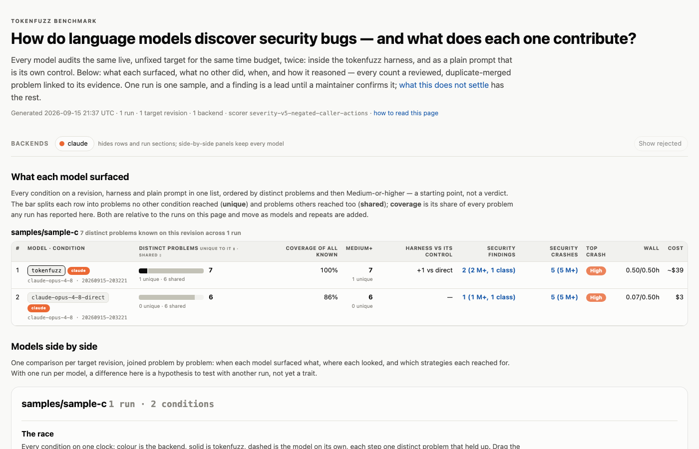
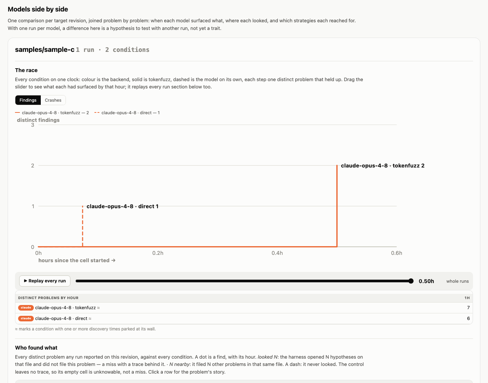

# Benchmarking TokenFuzz

`bin/benchmark` asks whether the harness earns its budget. It runs one
target two ways, as TokenFuzz and as the same model prompted directly, with
the same backend, model, and wall-clock budget, then scores both through the
same validation, clustering, and severity pipeline. The harness's
coordination, execution, and review cost stays inside the comparison rather
than being subtracted from it.

Use it to decide whether TokenFuzz is worth its cost on a kind of target, or
to check that a harness change helped. For routine target work, use
`bin/audit`.

!!! example "See a finished result"
    [](../assets/examples/benchmark-sample-c/benchmark-result.html)

    The handbook ships an
    [example result page](../assets/examples/benchmark-sample-c/benchmark-result.html)
    from a run against the C sample. [Example result](#example-result) has
    the command that produced it and what to look for.

A reported count is a number of reviewed evidence clusters. It is not a
count of independently proven root causes, and it is not precision or recall
unless the target has an answer key (see
[Ground truth](#ground-truth-precision-and-recall)).

| If you want to | Read |
| --- | --- |
| Run a comparison | [Quick start](#quick-start), then [Resuming an interrupted run](#resuming-an-interrupted-run) |
| Judge a result | [The experiment](#the-experiment), [How a result is counted](#how-a-result-is-counted), [Reading the results](#reading-the-results) |
| Reproduce or critique one | [Ground truth](#ground-truth-precision-and-recall) and [Fine print](#fine-print) |

## Quick start

```bash
bin/benchmark --target <target>
```

The target must already be set up, with source under `targets/<target>/` and
a reviewed `output/<target>/target.toml`; if it is not, start with
[Add a target](../getting-started/add-a-target.md). Nested slugs such as
`samples/sample-python` work.

With every default, this runs the `codex` backend in its own sandbox, three
replicates of each condition, and three hours (10,800 seconds) of audit wall
per cell. The six cells run one after another, so expect about 18 hours,
plus each cell's [closing pass](#the-closing-pass) and a final scoring step.
Then open `output/benchmark/benchmark-result.html`.

The options a first run needs:

- `--backend` (`claude`, `codex`, `gemini`, `grok`, or `oss`) and `--model`
  apply to both conditions. `oss` requires `--model`.
- `--replicates` (default 3) and `--budget-wall` (seconds per cell, default
  10800, `0` for unlimited) size the experiment.
- `--agent-security` sets the boundary for both conditions; see
  [agent security modes](../guides/backends.md#agent-security-modes).
- `--run-id` names the run; reuse it to [resume](#resuming-an-interrupted-run).
- `--dry-run` launches no backend but still scores and publishes synthetic
  cells, so point it at a scratch `--bench-root`.

Every flag is in the
[command reference](../reference/commands.md#benchmark-tokenfuzz).

<span id="what-a-run-looks-like"></span>

### Common variations

```bash
# Two replicates on Claude: a layout and sanity check, not a claim.
bin/benchmark --target <target> --backend claude --replicates 2

# Gemini and Grok are refused under sandboxed. Run them only inside a
# container or VM you hardened.
bin/benchmark --target <target> --backend gemini --agent-security external-bypass

# Several targets in turn. With --run-id, each gets a per-target suffix.
bin/benchmark --target samples/sample-c,samples/sample-go

# Archive the Claude ledger as benchmark-results.<UTC stamp>.bak.md and exit.
bin/benchmark --backend claude --reset
```

## The experiment

| Condition (`--conditions` token) | Row label | What runs |
| --- | --- | --- |
| `model-direct` | `<model>-direct`, or `<backend>-direct` when no model is known | The control. One launch of the backend CLI with one prompt, writing straight into its cell directory. The prompt carries the harness's goal framing, bug contract, threat model, and filing format, and nothing else: no work queue, probe runner, or triage. |
| `harness` | `tokenfuzz` | `bin/audit` as shipped: ranked work cards, strategy rotation, `bin/probe`, triage, validation, clustering, severity scoring, and reproducer bundles. |

### Same budget, not always the same spend

Every cell gets the same wall, and both conditions are told when it ends: the
direct prompt names a UTC deadline and a `date -u` command to check it. By
default nothing re-enters a direct session that stops early, because a
baseline the runner drives back to work measures the runner as well as the
model. Some models stop within minutes on a small target while others run to
the wall, so the default compares unequal spend; `Wall (h)` shows what each
condition used.

`--hold-direct` runs the equal-spend variant: a direct session that exits
cleanly with more than a minute left is relaunched until the wall, told what
it already filed. Held rows carry a `-held` suffix, so the two experiments
never share a label.

### Same wall, not the same worker capacity

The control is one CLI launch. Its prompt asks for a single-agent pass, but
the CLI's own subagent delegation stays on, because a control that cannot
delegate is not the product a user gets. The harness runs its worker pool,
normally three (`--agents`). So the result reports occupancy, worker-hours,
confirmed results per seat-hour, tokens, and cost beside the wall.

<span id="why-it-is-not-a-stopwatch"></span>

Nor is the result a raw tally. The direct prompt can produce more raw crash
directories, with little structure around duplicates or self-inflicted
testcases, while TokenFuzz spends budget on validation, deduplication, and
reproducers. Read severity and uniqueness before raw counts.

### Same isolation, same build

Both conditions launch under the same isolation: web tools, and the
instruction files, plugins, skills, and memory you installed, are switched
off wherever the CLI offers a per-run control. Antigravity (the default
`gemini` dialect) lacks plugin, memory, and web switches, so prefer
`USE_GEMINI_CLI=1` for Gemini rows; Grok Build lacks plugin and skill
switches. Disable their installed plugins by hand before quoting their rows
([details](../guides/backends.md#one-isolation-policy-for-every-launch)).

One agent-security profile covers both conditions of a run. Boundaries differ
across backends, most visibly in egress, so a cross-backend row compares two
products under their own boundaries. Every cell runs against one
[pinned build](#running-several-backends-at-once), never an alternate ASan
configuration, and from a copy of the harness taken when the run starts.

## How a result is counted

A row is only worth reading if both conditions were scored by the same rule.
This section is that rule.

### The closing pass

When a cell's audit wall ends, the runner stops its clock. Before the next
cell starts, it triages that cell's crashes and drains its finding gate. That
pass is *measurement*, not finding time: the artifact set is frozen at the
wall, so the closing pass cannot add a finding, and its time is not counted
in `Wall (h)`. Both conditions get the same closing pass.

- **Budget.** Crash triage and the finding drain each get their own
  `--finalize-wall` (default `0`, unlimited), so a slow crash phase cannot
  starve the findings. `--finalize-workers` (default 4) sets the concurrent
  reviewers.
- **Repeat until settled.** Each phase repeats while anything is pending,
  retrying from cached receipts. A pass that hits a provider cap is repeated
  once the cap is waited out, up to 12 pauses totalling six hours, all
  untimed. A pass that settles nothing and records no cap stops the phase,
  as does a provider refusal. The log names the stop.
- **A remainder** means the finalize wall expired, the provider refused or
  stayed capped, or a pass stalled (which looks the same as an outage that
  records no cap). `bin/benchmark --regenerate` continues from the receipts.

A run pins the versions of its gate prompts when it starts, so a prompt
change mid-run cannot split one cell's votes. `--regenerate` deliberately
does not pin: it exists to apply current policy to the artifacts on disk.

### What happens to anything unsettled

Nothing is guessed. An unvalidated finding stays out of the finding total,
and a sanitizer-backed crash with unfinished validation stays a visible
candidate with no credit or assumed severity.

A finished cell that still holds unjudged artifacts keeps its place. Its
count carries a `K unjudged` term, and when a condition's remainder
outnumbers its verdicts the count is also marked `≥`: a lower bound, not a
yield to compare. `--regenerate` retries those reviews.

A cell that produced no usable measurement is marked incomplete and kept out
of the medians, though its evidence is still shown as an observed count. The
causes are a provider limit that never cleared, an interruption before
substantive evidence, a failed closing pass, and source or build drift. One
exception: a direct backend that exits with an error *after* writing
substantive evidence is counted, with a `(Nt)` marker for its shorter wall.

### The security-decision table

Each run's ledger section tabulates review outcomes. The states are defined
in [Publication state](../guides/triage-results.md#publication-state).

| Outcome | Meaning |
| --- | --- |
| **Report** | Real security impact inside the declared attacker surface. The only outcome that enters security yield or gets a numeric severity. |
| **Not reportable** | A real defect that crosses no security boundary. Current triage writes this state only for a human-pinned finding and rejects other out-of-model results with a `threat-model:` reason, so this column fills only from pinned findings and older runs. |
| **Review unsettled** | Required review is missing, unusable, or split and not yet resolved. No credit; counted in the unjudged remainder. |
| **Rejected** | Failed a gate, or completed review placed it outside the threat model (`threat-model:`), could not place it after every required review answered (`unsettled-scope:`), or found it availability-only (`out-of-scope:`). |

### Scope is decided by reading source, not by the report

A report's `Trigger source` field is written by whoever found the bug, and it
errs both ways: a driver that calls documented entry points reads as
caller-driven even when attacker bytes decide the fault, and an unreproduced
claim reads as byte-driven even when only a caller can reach it. Taken at
face value, that penalises the condition that builds reproducers. So a
reviewer reads the source to decide whether the trigger is inside
`attacker_controls`, and its answer wins. The report's field decides only
when no reviewer answered (a machine proof, or a person's pin).

### Denial of service is not scored

A report whose only consequence is availability loss (CPU or memory
amplification, algorithmic or regex complexity, leaks, out-of-memory,
recursion depth, a fault that ends one request or process) is rejected on
both sides with an `out-of-scope:` reason. Filed under a `dos`-family
[bug class](../reference/bug-classes.md) with no scored `Primitive`, it is
rejected without a vote; under another class, the quality reviewer rejects
it. Crash triage already auto-rejects stack exhaustion and out-of-memory
diagnostics.

This is an accepted limitation. The harness scores boundary-crossing
primitives, and a condition that restates one quadratic loop at twenty sites
must not outscore one that found a memory-safety bug. The rejected reports
stay under `findings-rejected/`, and the direct prompt says up front that
availability-only reports are not scored.

### Both conditions face the same bar

The control's crashes are replayed through the target's configured
invocation before they count:

| Replay outcome | What happens |
| --- | --- |
| Reproduced the reported fault | Normal crash triage. |
| Ran, but did not reproduce, hit a different fault, or exited before reaching it | Demoted to a finding with that reason; source review judges the claim. |
| Can never run: a sanitizer the target does not build, driver source with no compiled driver, or no input or driver at all | Demoted to a finding with that reason. |
| Never ran: the target did not launch, or no replay contract resolved | Kept under `crashes/` with no verdict, counted as unadjudicated, and logged, so broken replay infrastructure neither destroys a real crash nor credits an unproven one. A verdict an earlier replay reached stands. |

Two more rules apply to both sides:

- **A machine proof skips trigger review.** A crash that reproduced five
  times out of five through the ordinary target binary with no extra
  arguments, faulting in the target's own code, on a target whose attacker
  controls include input bytes, needs no trigger review. The harness gets
  that proof from `bin/probe --confirm`, the control from the benchmark's
  five-run replay.
- **A reproducer tests the pinned build.** A driver that `#include`s a target
  source file compiles its own copy of that unit, perhaps one the pinned
  configuration never built. Crash triage asks the compiler which target
  units the driver compiled and demotes such a crash to a finding.

## Reading the results

### Where results land

All benchmark state lives under `--bench-root` (default `output/benchmark/`;
a relative path must stay under `output/`):

```text
output/benchmark/
  benchmark-result.html      # cross-run comparison: open this
  benchmark-result.md        # its tables as Markdown
  <backend>/
    benchmark-results.md     # the backend's ledger, one section per run
    benchmark-results.html
    <run-id>/
      run.json               # settings, pins, and revisions
      report.json            # aggregated result the pages read
      target.toml            # the run's config snapshot
      harness-snapshot/      # the harness every cell ran
      cells/                 # one directory per cell
      pool/                  # pooled, clustered, bundled evidence
```

`run.json` records the model, reasoning effort, and agent-security profile
actually passed to the CLI, the target and harness revisions, and the pinned
build, so an archived run stays reproducible after your settings change.
Every pooled crash that survives triage is bundled under `pool/crashes/` with
a `report.md`, `report.html`, and `reproduce.sh`.

You can open `benchmark-result.html` during a run. It refreshes as each cell
starts and finishes, under a provisional banner; wall, replicates, and tokens
fill in live, but reviewed counts read `Pending` until clustering runs after
the last cell.

To hand finished runs to someone, `bin/export-benchmark` packages them into a
path-scrubbed archive whose pages link only inside it. It leaves out
`cells/`, the console and severity logs, and compiled executables, but keeps
sanitizer reports and crash signatures, so share it deliberately.

<span id="reading-the-ledger"></span>

### The ledger

Each run section reads in review order: **Verdict**, **Scoreboard**,
**Efficiency**, **Security decisions**, the ground-truth blocks when the
target has an answer key, **Token usage** (closing pass included), and
**Bugs by severity**, which links each bug's reproducer bundle. Callouts
under the scoreboard name any cell excluded as incomplete and any artifact
published unjudged, with why. **Verdict** names the strongest observed crash
and which condition found it, or says no sanitizer-confirmed crash exists.

**Scoreboard** is the main comparison:

| Column | Meaning |
| --- | --- |
| `Condition` | `tokenfuzz` or the direct baseline label. |
| `Replicates` | `done/total`, with the `(Np)` and `(Nt)` [markers](#markers). A replicate that recovered from a provider pause got its full budget and is unmarked. |
| `Wall (h)` | Median hours spent over hours granted, such as `0.52/5.00h`. Read counts beside a short numerator as the yield of a shorter experiment. The closing pass is not counted. |
| `Worker-h` | Spent wall times the seats the condition ran. An upper bound on effort, not measured agent time, and not a yield denominator. |
| `Unique rejected findings` | FIND reports the validator rejected, after clustering. |
| `Security findings` | Distinct clusters of reportable non-crash findings, `N (M M+, C classes)`: M scored Medium or higher, across C canonical [bug classes](../reference/bug-classes.md). Every term counts clusters, so duplicate reports and alternate spellings cannot inflate it. |
| `Unique rejected crashes` | Crash candidates triage rejected, after stack-signature clustering. |
| `Unique security crashes` | Distinct reportable sanitizer-signature clusters with real sanitizer output on disk, `N (M M+)`, Low included. A reproduced crash outside the declared attacker controls is rejected; older runs show those as a `K retained` term. |
| `Top crash severity` | Highest crash severity in the row. |

A finding counts as a write-up of its own condition's crash, not a second
problem, when it embeds that crash's fault stack, or sits at the exact file
and line of one of that condition's reportable crash top frames with a
memory-safety or race class. A shared function is not enough.

Reportable and rejected results go through the same
[deduplication](deduplication.md). Signature clustering is a deterministic
proxy: one root cause can split across sites, and different root causes can
share a sink. Count cells link to the reports that produced them.

**Efficiency** says where each condition's wall went. An em dash means
unrecorded, never zero.

| Column | Meaning |
| --- | --- |
| `Occupancy` | Median occupied agent-seconds over seats × effective wall. |
| `Blocked housekeeping` | Median share of the wall the worker pool sat empty at the iteration barrier while housekeeping ran. Still charged to the wall. |
| `Review s/artifact` | Median crash-triage and result-gate seconds per artifact judged, in-wall and post-cell. Post-cell time stays out of `Wall (h)` but is real review cost. |
| `First filed` / `First crash confirmed` / `First admitted` | Median minutes from cell start to the first artifact filed, to the filing of the first crash later admitted, and to the first `reportable` receipt. The harness's crash times are `bin/probe` stamps; the control's come from file times. |
| `EXEC_FAIL share` | Median fraction of probes that started but produced no valid result. |
| `Duplicate roots` | Median share of artifact signatures filed by more than one agent: convergence, not yield. |
| `Confirmed / seat-h` | Reportable clusters per worker-hour, pooled over completed replicates, so a condition with more seats is charged for them. |
| `$ / confirmed` | Measured cost per reportable cluster. Withheld when any of the condition's cost is estimated or a spend floor, or nothing was confirmed. |

Each cell's `metrics.json` holds the same numbers under `telemetry`, with
`decisions` (review calls and failures; a timed-out review is lost gate
time, not a verdict) and `coverage` (ranked cards claimed and concluded per
strategy lane, so a starved lane shows as unclaimed). `lineage.jsonl` beside
it joins card, hypothesis, testcase, artifact, and signature.

<span id="reading-the-result-page"></span>

### The result page

`benchmark-result.html` reads each run's `report.json`, links every count to
its reports, opens locally, and keeps plain tables without JavaScript.

| Section | What to look for |
| --- | --- |
| **What each model surfaced** | Results by target revision and condition, split into signatures unique to that condition and signatures shared with other runs. Harness rows include a comparison with their own control. |
| **Models side by side** | The discovery race, which conditions reported each signature, attention by subsystem, and strategy use. |
| **Run by run** | Each run in full: what each side found, the harness's hypothesis history and probe events, what survived review, its time and token cost, and its cells. A target with an answer key adds a **Ground truth** panel. |
| **Ledger** | Sortable rows for every target, backend, condition, and run, with input, output, and cost. |

The page's "coverage" comparison is the share of distinct problems reported
by the runs shown on that revision: neither code coverage nor recall, and
"unique" is relative to those runs too. A harness cell marked "looked" has
recorded hypotheses on that file, which does not prove it investigated that
issue; the control keeps no such history, so its blank is unknown, not a
miss.

### Markers

Keep a marker with its value when you quote it:

| Marker | Meaning |
| --- | --- |
| `K unjudged` | K artifacts never reached a verdict; they earn no credit, so the count is a floor. |
| `≥` | The unjudged remainder outnumbers the verdicts; the count is a lower bound, not a yield to compare. |
| `up to N` | A rejected count that could not be fully deduplicated; an upper bound. |
| `(Np)` | N replicates a provider limit kept out of the totals; a same-run-id resume retries them. |
| `(Nt)` | N counted replicates whose backend exited early, so part of the count came from a shorter wall. |
| `≤` | A seat-hour rate whose seat count is a floor (a launch delegated to subagents, or the backend cannot show its fan-out), so the rate is an upper bound. |
| `~` | Estimated usage or cost, or a delegated spend the row cannot see. |
| `†` | Occupancy derived from file clocks on a cell that predates recorded session spans. |
| `‡` | Severities from a superseded scorer: its `M+` counts are not on the current scale. `--regenerate` rescores and clears it. |

Do not subtract a floor from a control, and do not compare or sum severity
subsets scored under different scorer versions.

<span id="how-to-make-the-result-worth-reading"></span>

### Before you quote a result

- If both conditions report zero, inspect setup failures, unjudged artifacts,
  and budget actually spent. Zero alone cannot tell a hard target from an
  inadequate budget or an ineffective approach.
- LLM runs are stochastic. Use five or more replicates across more than one
  target (a rule of thumb, not a power calculation), and report the
  variability: a harness change that helps one parser and hurts another
  should not vanish into one headline row.
- Read the Medium+ subset and top crash severity before raw crash count. A
  pile of duplicated low-value crashes is not a stronger result than one
  clean, reachable reproducer.
- Keep the target fixed while comparing harness changes, and compare only
  rows recorded under the same agent-security profile.

### Example result

The handbook's example was exported from this run against the planted-bug C
sample, one replicate per condition on a 30-minute budget:

```bash
bin/benchmark --target samples/sample-c --backend claude --model claude-opus-4-8 \
  --replicates 1 --budget-wall 1800 --bench-root benchmark-sample-c
```

Open the [cross-run comparison](../assets/examples/benchmark-sample-c/benchmark-result.html)
or the [backend ledger](../assets/examples/benchmark-sample-c/claude/benchmark-results.html),
which is scored against the sample's answer key. The copy omits the run's
cells and JSON state, so links into a cell directory do not resolve.

[](../assets/examples/benchmark-sample-c/benchmark-result.html)

What to look for:

- **Recall.** Both conditions found all five crash-scored bugs and the
  release-build overflow the answer key scores as a finding.
- **Spend.** The control stopped after about five minutes of its half hour
  (`0.09/0.50h`); the harness ran to the wall (`0.50/0.50h`) on three seats,
  so its `Worker-h` reads `1.50h`.
- **Clustering.** The harness filed that finding at two adjacent lines, and
  finding clusters key on the line, so its column reads two distinct
  problems where the answer key credits one bug.
- **Unjudged evidence.** One harness crash candidate never reached a verdict,
  so the harness crash cell reads `5 (4 M+, 1 unjudged)` and credits nothing
  for it.

## Ground truth: precision and recall

The scoreboard counts crashes by sanitizer evidence, which keeps the count
honest but cannot say *which* bug a crash is. A real target has no oracle for
that, so its precision and recall go unmeasured, and so do the gate
thresholds tuned to them.

The **canary** target closes that gap: a small synthetic record-processing
program at `targets/canary/` with seven planted memory-safety bugs and two
false-positive traps (inputs that look dangerous to a reviewer but are not a
memory-safety fault). Each planted bug names the strategy shape it exercises
(S2, S3, S5, or S7), and the ledger reports recall per sanitizer primitive
and per strategy shape, so a run that finds every overflow and no lifetime
bug reads as that. The strategy label classifies the plant; it does not
credit the lane that found it. `tests/test_canary_planted.py` checks every
answer-key entry against the sanitizer's own report. Seven hand-crafted bugs
are a regression calibration set, not a representative sample: the score is
exact for this key and sets no confidence bound for an unseen target or bug
class.

The seventeen `samples/sample-*` targets carry answer keys the same way, for
Rust, Go, Python, Java, and the rest; see
[Sample targets](../getting-started/sample-targets.md).

### The answer key

The key lives at `output/<slug>/.ground-truth.json`, outside the tree handed
to the audited agents, and the scorer reads it only after the run; no prompt
contains it. That separation is not an access control on other files the
backend can read, so account for it before making blind-evaluation claims.

Each entry is a planted bug or a trap:

- **A planted bug** pins its sanitizer `primitive` and the `signature_symbol`
  it crashes in.
- **`findings_only: true`** marks a bug expected not to crash. A confirmed
  finding credits it when the function it names as at fault is the bug's
  `signature_symbol` (in the entry's `file`, when it pins one).
- **`auto_quarantined: true`** marks a crash shape the harness sends straight
  to `crashes-rejected/`, such as a zero-page null deref or OOM. `AGENTS.md`
  tells agents not to file these, so the entry sits in neither denominator.
- **A trap** declares the benign outcome it expects. A confirmed finding at a
  clean-outcome trap counts against finding precision; a trap that expects an
  abort refutes that crash. A trap may name the `classes` it refutes; one
  that names none fires for every class.

Every other confirmed finding is **open-world**, since real code has bugs no
key planted, and counts neither for nor against.

??? note "Matching details"
    - `alternate_signatures` give one defect several runtime shapes, each a
      `primitive` and `signature_symbol`, optionally with `access: READ` or
      `WRITE` when an optimizer inlines distinct operations into one symbol.
      Aliases score as the same bug; overlapping aliases fail validation.
    - A file-pinned entry needs a report whose location agrees: `a.c:parse`
      cannot credit a bug at `b.c:parse`. A basename compares only when one
      side is basename-only, as with a bare stack frame; a report that
      locates nothing cannot credit a file-pinned entry.
    - A crash at a findings-only or auto-quarantined symbol is not credited
      to it and stays an unexpected crash.
    - `classes` on a real bug separate two bugs at one function, and a trap
      that declares the report's class claims it when the bug's classes
      exclude that class. A report whose class matches none of a bug's
      classes is not credited, except that a same-family class is enough
      where the function holds that one bug and no trap.

### Running and reading the score

`targets/canary/run-benchmark.sh` builds the canary and runs a one-replicate,
900-second benchmark. Extra arguments go to `bin/benchmark`:

```bash
targets/canary/run-benchmark.sh --backend claude
# equivalently, by hand:
#   bin/setup-target canary --build --no-llm-config
#   bin/benchmark --target canary --replicates 1 --budget-wall 900 --backend claude
```

At the end of any run on a target with a key, the ledger gains ground-truth
blocks and `benchmark-result.md` an **Answer key** section, with recall and
precision per run, condition, and kind:

| Metric | Definition |
| --- | --- |
| Crash recall | Share of crash-scored planted bugs (neither `findings_only` nor `auto_quarantined`) confirmed at their crash site by a runtime sanitizer artifact. Attribution reads only the sanitizer's own output, never an agent's `report.md`, so prose cannot earn recall. |
| Crash precision | Share of confirmed crashes that are planted bugs, per crash. A fired abort trap, an unexpected crash, and a confirmed crash with no runtime artifact all count against it. |
| Finding recall | Share of `findings_only` bugs credited by a confirmed finding. |
| Finding precision | Credited findings over credited findings plus findings that fired a trap. Open-world findings count neither way. |

A ratio with nothing to divide is shown as `—` (unscored), not 0%. A healthy
canary run shows high recall *and* high precision. The direct baseline is
measured by the same rule; the result, not an expected winner, is the point.

To score an existing results or pool tree without launching anything:

```bash
bin/benchmark score output/canary/<backend>/results \
  --ground-truth output/canary/.ground-truth.json
```

It takes a `crashes/` directory or a `results/` or `pool/` directory holding
one, and prints JSON; see the
[command reference](../reference/commands.md#benchmark-tokenfuzz) for its
options. Unlike the ledger, it also scores pooled artifacts still unjudged.

Tune gate thresholds against this labelled signal, precision first: a change
that raises recall but lets a trap through is a regression the canary catches
before it reaches a real audit.

### Measuring recall on real bugs

The same manifest works for any target. Add `output/<slug>/.ground-truth.json`
with `planted_bugs` naming the real crashing symbols and primitives, pin the
target to a vulnerable revision, and run the benchmark as usual.

!!! warning "Keep real-bug manifests local; never commit them"
    A real-bug manifest can hold disclosure-sensitive symbols, inputs, and
    diagnostics; see the
    [neutral-fixture rule](../development.md#testing-discipline). It is
    gitignored by default, which prevents accidental tracking, not access or
    disclosure through an archive, report, or tool. Only the synthetic canary
    and sample keys are committed.

## Fine print

### Running several backends at once

Several runs, of one backend or several, can benchmark one target at once.
Each run locks only its own run directory; a second launch of a live run id
is refused. A `FIND-*` or `CRASH-*` written into the shared target tree
instead of a cell's own results has no trustworthy owner, so it is never
counted, and the observing cell is marked `unowned_artifacts`.

A run pins one build and one source state:

- **Build.** A fresh run converges its native build once, records the exact
  runner, executable, library, and build-stamp bytes, and refuses to start
  on a build it cannot verify. Its shared build leases stop
  `bin/setup-target`, `bin/build-configs`, and audit preflight from
  replacing the build during the run. Cells and resumes never build.
- **Source.** The target's git or Mercurial revision and tracked content;
  untracked testcases and output do not count. A run started while another
  has pinned a different state is refused. Use a separate checkout, or wait.

Three conditions take a cell out of the headline comparison while keeping
its artifacts:

- `source_drift`: the target's tracked source differs from the pin when the
  cell ends. Editing the harness does not cause this, but it does block a
  later [resume](#resuming-an-interrupted-run).
- `build_drift`: the build changed, which only a build command run outside
  the leases can cause.
- `processes_unreaped`: a cell left processes the runner could not end. The
  run stops; end them and resume.

`--isolate-build` gives a run its own `build-asan+bench-<input-hash>/` tree,
shared only with runs whose build inputs match. Use it to compare build
recipes over the same source; it cannot isolate a different source revision.
An isolated tree outlives its run for `--regenerate` and is collected once no
run on disk refers to it; the canonical build is never collected.

### Resuming an interrupted run

Provider quota, an interruption, or a timeout can leave cells unfinished.
Rerun the same command with the run id:

```bash
bin/benchmark --target <target> --backend claude --replicates 2 \
  --run-id 20260530-142558
```

Cells marked `done` are skipped. Every other cell, including one excluded for
a provider limit, is wiped and rerun, so half-written artifacts never fold
into the result. `--replicates` is the desired total, so raising it adds
cells, and you can resume a subset of `--conditions`.

A resume verifies the recorded build rather than rebuilding, and refuses,
naming the reason, if anything that defines the experiment has changed:

- the model, reasoning effort, agent-security profile, `--budget-wall`,
  `--agents`, or `--hold-direct`;
- the target revision, tracked source, build, or the run's `target.toml`
  snapshot;
- the harness commit, or harness files (`bin/`, `lib/`, `.agents/`,
  `config/`, `docs/`, `schema/`, and root files such as `AGENTS.md`) that
  differ from the run's snapshot, so finish a run before editing the harness.

`--finalize-wall` and `--finalize-workers` may change, because they govern
measurement, not what the agents did.

Both conditions pause for provider-withheld capacity for up to six hours
(`PROVIDER_PAUSE_MAX_SECONDS`), and the wait counts against neither the audit
budget nor `Wall (h)`. A direct session the provider cuts off is re-entered
with the wall it had left; one the pause cannot bring back is excluded rather
than scored short, and a resume reruns it. Once one cell hits a limit that
never cleared, the run marks its remaining cells provider-limited without
launching them.

### Regenerating results after code changes

When you change deterministic post-processing, the cells on disk are still
valid. Re-derive the results instead of launching agents:

```bash
# The backend's most recent run, whatever its target; --run-id picks one.
bin/benchmark --target <target> --backend claude --regenerate
bin/benchmark --regenerate       # every run under the bench root
bin/benchmark --rebuild-report   # only the root result pages
bin/benchmark --prune-cache      # drop cached harness builds no evidence names
```

`--regenerate` launches no audit agents. It re-routes, validates, scores,
clusters, and renders the evidence on disk and recomputes cell status, so a
cell once marked incomplete over one pending artifact can recover. Source
review may call the configured reviewer where a receipt is missing or stale;
sanitizer, scoring, and counting work does not. Provider-limited, drifted,
and failed cells stay excluded, except a direct cell that failed after
writing substantive evidence.

`--rebuild-report` rewrites only the root `benchmark-result.md` and `.html`;
use it after deleting or archiving run directories. `--prune-cache` removes
cached `bin/probe` harness builds that no evidence names from finished
harness cells. It narrows to `--target` and `--run-id`, only reports under
`--dry-run`, skips live or unfinished runs, and touches no evidence.

Regeneration cannot manufacture evidence an old cell never recorded. A crash
whose recorded build identity no longer matches is not replayed, and its
settled verdict stands. A missing bundle is built at the run's recorded
revision but with the target's current build recipe. An existing bundle
report is rewritten only when its stated reproduction rate differs from the
pool's; hand-edited reports are otherwise left alone. A crash with no
measured rate is replayed against its own cell's build, and a run counts
only if it hit the original fault; a replay that cannot run leaves the rate
unset.

A fresh run is needed only to measure discovery, recall, or harness overhead
under new code, to collect prerequisites that were never saved, or to
publish a comparison in which both conditions ran under the new audit
contract. It is not needed to correct severity, routing, or report metrics.
