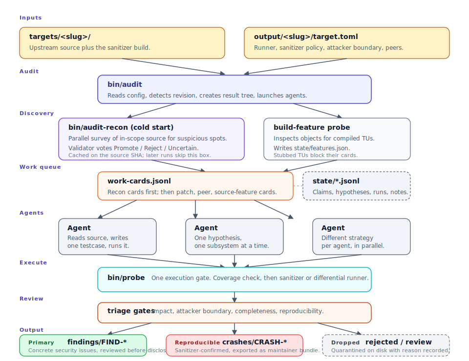

# System Architecture

[](../assets/system-architecture.svg){target="_blank" title="Open full-size diagram in a new tab"}

TokenFuzz has a small number of moving parts. This page walks through
them in the order they show up in a session:

- directory model;
- the audit run;
- breadth-first recon (cold start only);
- the work queue and structured state;
- agents;
- the probe runner;
- triage and results;
- backends and modes;
- quality gates.

The boundary worth remembering:

- **Upstream source lives under `targets/`.**
- **Audit state and results live under `output/`.**

Almost every design decision in the harness exists to keep that
boundary clean.

## Directory model

```text
repo root/
  bin/                         command-line entry points
  targets/<target>/            upstream source checkout + sanitizer build
  output/<target>/target.toml  generated target config
  output/<target>/<backend>/   per-backend results, state, and logs
```

The harness does not write audit artifacts into the target source
tree (unless a target-specific build command does so itself).

## The audit run

`bin/audit` owns session setup and supervision. On startup it reads
`target.toml`, detects the source revision, creates the result and
log directories, builds a ranked queue of source files to look at,
and launches the selected backend. Its job is to create a controlled
loop in which agents must produce evidence — not to decide that any
particular source pattern is a finding.

The ranked queue is built from a few signals:

- **recon candidates** from the cold-start review pass (described next);
- which files handle untrusted input or do raw memory work;
- which files were recently touched by security-relevant fixes;
- which files are covered (or not covered) by existing tests;
- peer projects that share the same code or specs, when configured.

The ordering is deterministic first. An optional LLM rerank may
boost cards, but if it is disabled, times out, or returns malformed
JSON, the deterministic order stands. The harness never lets a model
decide what is *in scope*.

Agents claim one entry from the queue at a time, so two agents do not
fight over the same source.

## Breadth-first recon (cold start only)

The first time `bin/audit` sees a given commit of the target source,
it runs `bin/audit-recon` — a short parallel survey of the in-scope
source set before the deep agents launch. Several agents sweep the
selected files for candidate bugs (calibrated for recall, not
precision), and a second model independently votes each emission
Promote / Reject / Uncertain.

The votes shape the queue:

- **Promoted** candidates get claim-time precedence over ordinary
  cards. When a target enables more than one sanitizer, a promoted
  card is consolidated per sanitizer and can be claimed under either
  allowed recon strategy.
- **Rejected** candidates are demoted, not deleted — testcase
  evidence can still overturn the validator.

Recon results are cached on the target source SHA, so later audits
against the same commit skip the survey and start the deep agents
immediately. Full detail is in
[Recon discovery](../guides/recon-discovery.md).

## Work queue and structured state

The work queue is the scheduler's contract with the agents. It and
the state files around it are append-only, so the run survives
crashes and compactions:

```text
work-cards.jsonl       ranked source, recon, patch, and peer-fix cards
state/features.json    translation units the current build actually compiled
state/claims.jsonl     card leases and terminal status
state/hypotheses.jsonl active and closed hypotheses
state/runs.jsonl       probe verdicts
state/notes.jsonl      compact supporting notes
state/events.jsonl     audit event log shared across agents and orchestrator
```

`features.json` is the output of a fail-open build probe that runs
once at audit startup, when the sanitizer build's object files are
available for inspection. It is how cards whose source was stubbed
out of the current build are marked `blocked` — a statement about
this build configuration, not about the source.

An agent skips cards that are already claimed, on a surface another
agent owns, mode-incompatible, build-blocked, in a guard-saturated
subsystem, or in a subsystem another generic-mode agent already owns
(unless the current agent has produced a crash or finding there).
Claims expire on a timer so a wedged agent does not poison the queue.
[Strategy model](strategy-model.md#how-a-card-gets-to-an-agent)
carries the full ruleset and the rationale for each rule.

## Agents

Each agent is a small autonomous worker:

- it has a role (`reproduce` or `analysis`) and a strategy (S1–S8);
- it reads source through capped wrappers so prompts stay small;
- it writes one testcase at a time and runs it immediately;
- it keeps a compact state snippet so a context compaction doesn't
  lose the thread.

Agents do not browse the source freely. The work queue points them at
specific files, and the strategy decides what to look for inside
those files — prior fixes, spec gaps, lifetime and state sequences,
differential oracles, and so on. If the current strategy goes dry,
the harness rotates the agent to a different one — only after
structured state confirms the method was actually tried (see
[Strategy model](strategy-model.md#strategy-rotation)).

## The probe runner

A single execution gate (`bin/probe`) runs every testcase. It:

- reads the testcase header;
- picks the right runner (browser, JS shell, generic CLI, C/C++ or
  language harness, differential, or the configured `[runner]`);
- captures output and writes the result to `state/runs.jsonl`.

For API-level testcases, the runner can compile a sibling harness
source file, cache the compiled binary, and link it against the
configured sanitizer library. For browser and JS targets, a coverage
check runs first so a testcase that doesn't reach the named function
does not burn a full sanitizer run.

`bin/probe` discovers the active audit by walking upward from the
testcase to `.session-env` in the result tree, so agents do not need
to export target paths manually.

The same gate enforces saved output for testcase-backed results:
crash promotion requires a captured probe output file, while
report-only FINDs go through FIND validation instead.

## Triage

Triage is the boundary between "an agent produced an artifact" and
"this is worth human review." Two contracts, deliberately different:

- **Crashes** need a runnable testcase, saved sanitizer or
  differential output, complete report fields, declared
  attacker-surface fit, and they must not be a low-value class (OOM,
  assertion-only abort, stack overflow, plain null deref).
- **Findings** need substance — a concrete location, an explicit
  issue class, and a rationale a reviewer can act on. A sanitizer
  reproducer is *not* required.

Empty FIND directories stay in place marked `.needs-content`.
Findings rejected twice by the substance gate are quarantined to
`findings-rejected/` rather than deleted.

## Results layout

```text
output/<target>/<backend>/results/
  scratch-N/                   in-progress testcase work
  crashes/                     accepted reproducible crashes
  crashes-needs-review/        borderline rejections paused for review
  crashes-rejected/            rejected with reasons (skipped next session)
  findings/                    concrete security issues (with or without repro)
  findings-rejected/           findings the substance gate rejected (quorum)
  corpus/                      saved seeds with metadata
  state/                       claims, hypotheses, notes, runs, build features
  work-cards.jsonl             the ranked queue
  patch-cards.jsonl            prior-fix work cards (strategy S1)
  s6-peer-cards.jsonl          peer-project fix cards (strategy S6)
  recon-hypotheses.jsonl       recon candidates (cold-start survey)
  recon-findings.md            human-readable recon report
  .recon-cache-marker          (target SHA, recon prompt SHA) — cache key
  .session-env                 probe discovery file for this result tree
```

Cross-backend rollups live at:

- `output/<target>/CRASH-CLUSTERS.html`
- `output/<target>/FINDING-CLUSTERS.html`

## Backends and modes

The backend changes the agent process, not the audit contract:

```bash
bin/audit --backend <backend> --target <target> [--model <model>]
bin/audit --backend all --target <target>   # cycle installed hosted backends across iterations
```

In ensemble mode, each iteration selects the next configured hosted
backend in `claude → codex → gemini` order. Each backend writes into
its own result tree. That is the ensembling surface: same target
revision, same probe and triage rules, and independent evidence
directories per backend.

```toml
is_browser = "0"   # CLI tools, libraries, decoders, parsers, protocols
is_browser = "1"   # browsers and browser-like runtime targets
```

Browser mode enables HTML/JS testcase assumptions, browser and shell
agents, coverage-gated runs, and JS differential mode.

Generic mode is for everything else. Findings-only mode is gated by
`[sanitizer].enabled = []` in `target.toml`, not by the language
itself — typical for interpreted runtimes like Python, Ruby, Node,
Java, PHP, but valid for any project where ASan isn't appropriate.
In findings-only mode the probe runner invokes the configured
`[runner]` and runtime diagnostics are filed under `findings/`
instead of `crashes/`.

## Quality gates

The mechanisms that keep the loop honest:

- testcase headers tied to target code and hypothesis IDs;
- probe-first execution for crash candidates and testcase-backed
  findings;
- multi-run confirmation for crash candidates;
- first-class FIND validation for non-crashing security issues;
- a rejected index for low-value crashes so they do not come back;
- reachability, severity, and crash clustering as review aids;
- capped search wrappers and session seeds to keep prompts small;
- effort-gated strategy rotation;
- report fields that triage can parse mechanically.

The architecture is intentionally opinionated: **model reasoning is
useful only when it ends in reproducible evidence.**
