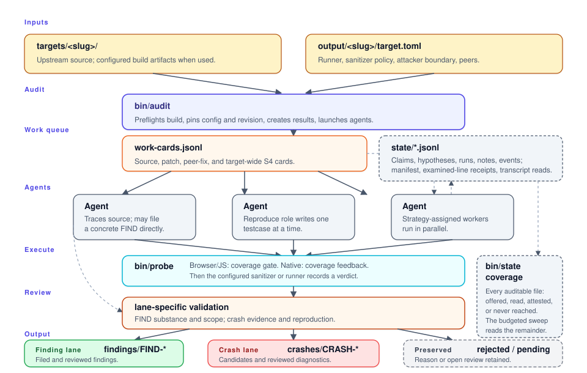

# System Architecture

[](../assets/system-architecture.svg){target="_blank" title="Open full-size diagram in a new tab"}

TokenFuzz has a small number of moving parts. This page walks through
them in the order they show up in a session:

- directory model;
- the audit run;
- the work queue and structured state;
- agents;
- the probe runner;
- triage and results;
- backends and modes;
- quality gates.

The boundary worth remembering:

- **Upstream source lives under `targets/`.**
- **Audit state and results live under `output/`.**

Almost every design decision in the harness exists to keep that
boundary clean.

## Directory model

```text
repo root/
  bin/                         command-line entry points
  targets/<target>/            upstream source checkout + sanitizer build
  output/<target>/target.toml  generated target config
  output/<target>/<backend>/   per-backend results, state, and logs
```

Audit evidence never goes into the target source tree. Build commands may write
build artifacts there, and the automatic builder stores reusable recipes under
`targets/<target>/.audit/`.

## The audit run

`bin/audit` owns session setup and supervision. On startup it reads
`target.toml`, detects the source revision, converges the required build and
execution routes, creates the result and log directories, and writes a
results-local configuration snapshot. That snapshot is immutable for the run,
so live agents cannot silently change the runner, build, or threat model behind
recorded evidence. The harness then builds the ranked queue and launches the
selected backend. Its job is to create a controlled loop in which agents must
produce evidence — not to decide that any source pattern is a finding.

The ranked queue is built from a few signals:

- which files handle untrusted input or do raw memory work;
- which files were recently touched by security-relevant fixes;
- which files are covered (or not covered) by existing tests;
- peer projects that share the same code or specs, when configured.

The ordering is deterministic first. An optional LLM rerank may
boost cards — or, in its `primary` experiment mode
([`RANK_WORK_LLM_MODE`](../reference/environment.md#local-model-endpoint)),
order the ranked window outright with the deterministic score as the
tiebreaker — but if it is disabled, times out, or returns malformed
JSON, the deterministic order stands, and in either mode the model
only reorders the cards it was shown. The harness never lets a model
decide what is *in scope*.

Agents claim one entry from the queue at a time. Claims prevent duplicate work
on the same card or active surface; different strategy cards for one file can
still coexist when the scheduler's subsystem rules allow them.

## Work queue and structured state

The work queue is the scheduler's contract with the agents. Durability does not
mean every file is append-only: materialized views are replaced atomically,
while event-style ledgers append rows.

```text
work-cards.jsonl       ranked materialized queue; rewritten on refresh
state/claims.jsonl     append-only card lease and release events
state/hypotheses.jsonl current hypothesis rows; atomically updated
state/runs.jsonl       append-only probe verdicts
state/notes.jsonl      append-only compact supporting notes
state/events.jsonl     append-only audit events
```

An agent skips cards that are already claimed, on a surface another
agent owns, mode-incompatible, or in a subsystem another generic-mode agent already owns
(unless the current agent has produced a crash or finding there).
Claims expire on a timer so a wedged agent does not poison the queue.
[Strategy model](strategy-model.md#how-a-card-gets-to-an-agent)
carries the full ruleset and the rationale for each rule.

## Agents

Each agent is a small autonomous worker:

- it has a role (`reproduce` or `analysis`) and an active strategy (S1 through S8);
- it reads source through capped wrappers so prompts stay small;
- a reproduce agent writes one testcase at a time and runs it immediately;
- an analysis agent primarily traces source and may file a concrete source-only
  finding without first writing a testcase;
- it keeps a compact state snippet so a context compaction doesn't
  lose the thread.

Agents do not browse the source freely. The work queue points them at
specific files, and the strategy decides what to look for inside
those files — prior fixes, spec gaps, lifetime and state sequences,
property oracles, and so on. If the current strategy goes dry,
the harness rotates the agent to a different one — only after
structured state confirms the method was actually tried (see
[Strategy model](strategy-model.md#strategy-rotation)).

## The probe runner

A single execution gate (`bin/probe`) runs every testcase. It:

- reads the testcase header;
- picks the right runner (browser, JS shell, generic CLI, C/C++ or
  language harness, or the configured `[runner]`);
- captures output and writes the verdict to `state/runs.jsonl`, with the
  wall seconds the execution took.

That duration matters more than it looks. A harness can loop internally, so one
recorded run may stand for a single call or for hundreds of thousands — the run
count alone cannot tell those apart. `bin/state strategy-yield` therefore
reports `seconds`, `timed_runs`, `untimed_runs`, and `seconds_per_timed_run`
beside `runs`, so a strategy that consumed the session does not read as a cheap
one. A row written by a caller that supplies no duration counts as untimed
rather than as a free probe. The timing spans sibling-build routing, because
the recorded verdict can come from a routed candidate.

For API-level testcases, the runner can compile a sibling harness source file,
cache the compiled binary, and link it against the configured sanitizer
library. Browser and JS targets use their configured coverage artifacts as a
gate: a miss stops before the sanitizer. Generic native targets can use a
route-equivalent SanitizerCoverage sibling as feedback; a native miss still
runs the configured sanitizer. When no native sibling exists, the run proceeds
with coverage unavailable rather than reporting a false miss.

`bin/probe` discovers the active audit by walking upward from the
testcase to `.session-env` in the result tree, so agents do not need
to export target paths manually.

The same gate enforces saved output for testcase-backed results:
crash promotion requires a captured probe output file, while
report-only FINDs go through FIND validation instead.

## Triage

Triage is the boundary between "an agent produced an artifact" and
"this is worth human review." Two contracts, deliberately different:

- **Crashes** need a runnable testcase, saved sanitizer output,
  complete report fields, and they must not be
  a low-value class (OOM, assertion-only abort, stack overflow,
  plain null deref). A trigger source outside the declared attacker
  surface does not reject a crash — it stays in `crashes/`, marked
  `not-reportable`: a real engineering defect, but outside the security
  total and carrying no numeric CVSS score.
- **Findings** need substance — a concrete location, an explicit
  issue class, and a rationale a reviewer can act on. A sanitizer
  reproducer is *not* required.

Crash class and bundle completeness are deterministic. A source-reading
trigger reviewer needs two disproof-backed Reject votes to remove a
sanitizer-confirmed crash and otherwise fails open. Findings need two
substance-gate accepts to confirm (or two rejects to quarantine), followed by
source review of the trigger and exact claimed security consequence. A finding
is quarantined only when two anchored reviewers agree that the trigger is
unreachable or the claimed consequence is affirmatively source-disproved;
missing evidence fails open.

Empty FIND directories stay in place marked `.needs-content`.
Findings rejected twice by the substance gate are quarantined to
`findings-rejected/` rather than deleted.

## Results layout

```text
output/<target>/<backend>/results/
  scratch-N/                   in-progress testcase work
  crashes/                     filed crash candidates and reviewed crashes
  crashes-rejected/            rejected with reasons (skipped next session)
  findings/                    filed findings and their review state
  findings-rejected/           findings triage rejected at quorum
  corpus/                      saved seeds with metadata
  state/                       claims, hypotheses, notes, runs, events
  work-cards.jsonl             the ranked queue
  patch-cards.jsonl            prior-fix work cards (strategy S1)
  s6-peer-cards.jsonl          peer-project fix cards (strategy S6)
  .target.toml                 immutable post-preflight target snapshot
  .session-env                 probe discovery file for this result tree
```

Directory placement alone is not a publication decision. A current validation
receipt records whether an artifact is reportable, unjudged, pending content,
or a retained non-reportable engineering defect. Rejected artifacts move to the
corresponding `*-rejected/` tree with their reason.

Each of the four result trees carries its own generated HTML index —
`CRASH-CLUSTERS.html`, `FINDING-CLUSTERS.html`, `REJECTED-CRASHES.html`,
`REJECTED-FINDINGS.html`. Cross-backend rollups exist for the two active
evidence trees, but not for rejected artifacts:

- `output/<target>/CRASH-CLUSTERS.html`
- `output/<target>/FINDING-CLUSTERS.html`

## Backends and modes

The backend changes the agent process, not the audit contract:

```bash
bin/audit --backend <backend> --target <target> [--model <model>]
bin/audit --backend all --target <target>   # cycle installed hosted backends across iterations
```

In ensemble mode, each iteration selects the next configured, installed, and
security-compatible hosted backend in `claude → codex → gemini → grok` order.
Each backend writes into its own result tree. That is the ensembling surface:
same target revision, same probe and triage rules, and independent evidence
directories per backend.

```toml
is_browser = "0"   # CLI tools, libraries, decoders, parsers, protocols
is_browser = "1"   # browsers and browser-like runtime targets
```

Browser mode enables HTML/JS testcase assumptions, browser and shell agents,
and a pre-run coverage gate. Where the gate cannot run for a browser, the probe
records why and falls open to the diagnostic run.

Generic mode is for everything else. Findings-only mode is gated by
`[sanitizer].enabled = []` in `target.toml`, not by the language
itself — typical for interpreted runtimes like Python, Ruby, Node,
Java, PHP, but valid for any project where ASan isn't appropriate.
In findings-only mode the probe runner invokes the configured `[runner]` and
records its runtime diagnostic. It does not turn a panic or traceback into a
FIND automatically: an agent must still write a substantive security report,
and that report passes the findings validation lane. Sanitizer-class signals
remain crash candidates when an enabled detector emits them.

## Quality gates

The mechanisms that keep the loop honest:

- testcase headers tied to target code and hypothesis IDs;
- probe-first execution for crash candidates and testcase-backed
  findings;
- multi-run confirmation for crash candidates;
- first-class FIND validation for non-crashing security issues;
- a rejected index for low-value crashes so they do not come back;
- severity scoring and crash clustering as review aids;
- capped search wrappers and session seeds to keep prompts small;
- evidence-aware strategy rotation, with a forced fallback for a method that
  never produces qualifying evidence;
- report fields that triage can parse mechanically.

The architecture is intentionally opinionated: model reasoning becomes useful
when it ends in reviewable evidence — a reproducible diagnostic, or a concrete
security report anchored in source.
