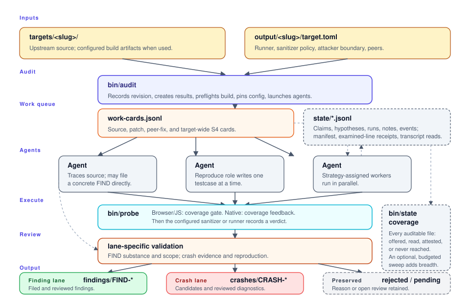

# System architecture

[](../assets/system-architecture.svg){target="_blank" title="Open full-size diagram in a new tab"}

TokenFuzz separates three responsibilities: agents propose and investigate
claims, the probe records what executed, and triage reviews the saved
evidence. Structured state connects those steps, so a run can continue after
an agent exits or loses context.

The directory boundary is simple: upstream source and builds live under
`targets/`; audit evidence, progress, and logs live under `output/`. This
page explains each component and where its responsibility ends. For the
sequence of a run, see [Audit lifecycle](audit-lifecycle.md).

## Directory model

```text
repo root/
  bin/                         command-line entry points
  targets/<target>/            upstream source checkout + sanitizer build
  output/<target>/target.toml  generated target config
  output/<target>/<backend>/   per-backend results, state, and logs
```

Audit evidence never goes into the target source tree. Build commands may
write build artifacts there, and the builder keeps its recipes, logs, and
bootstrap virtualenv under `targets/<target>/.audit/`. That directory is the
harness's workspace, never auditable source: the source walk skips it, along
with VCS metadata, runtime caches, sanitizer build trees, and virtualenvs.

## The audit run

`bin/audit` owns session setup and supervision. Its job is to run a
controlled loop in which agents must produce evidence, not to decide that
any source pattern is a finding.

Before any agent starts, it converges the builds and pins an immutable
snapshot of the configuration (`.target.toml`) in the results tree, so live
agents cannot silently change the runner, build, or threat model behind
recorded evidence. It also takes a shared lease on each build tree, so a
rebuild cannot replace the binary the evidence was measured against; a lease
it cannot get is a warning for an audit and a hard stop for a benchmark.
[Audit lifecycle](audit-lifecycle.md#3-run-the-audit) gives the full startup
order.

Once running, an ordinary audit is a **continuous run**: every slot stays
busy until the wall. A **steward tick**, every five minutes by default,
re-ranks the queue, releases stale claims, and rotates starved strategy lanes
without stopping any session. A background gate reviews each artifact once
no live session is still writing it, and one final barrier after the last
slot drains runs the work that is unsafe beside a live session.
Pinned-strategy, delta, `--no-refill-workers`, and ensemble runs use a
cohort loop with a pass after every iteration instead.
[How slots are scheduled](audit-lifecycle.md#how-slots-are-scheduled) has
the details.

## The ranked queue

The queue is built deterministically from a few signals:

- code features: input-consumption entry points, deserialization sinks, raw
  memory and lifetime operations, allocation, command and query
  construction, access-control and credential decisions, and more;
- files touched by earlier security-relevant fixes;
- subsystems no probe has reached yet;
- path shape, and seeds already promoted to the corpus.

A **diversity floor** reserves part of the window for low-scoring files
across subsystems, so the scoring rules alone do not define scope.
Peer-project fixes and the target-wide S4 fuzz campaign enter as cards of
their own rather than as ranking signals.
[Strategy model](strategy-model.md#how-the-visible-window-is-filled)
explains how the window is filled.

An optional one-shot model rerank then adjusts the order: by default
(`primary`) it orders the window by how directly the declared attacker
controls reach each file, with the deterministic score as tiebreaker, and in
its `boost` mode
([`RANK_WORK_LLM_MODE`](../reference/environment.md#model-decisions)) it only
adds a bounded increment to the cards it scores. The keyword score cannot
tell a reachable parser from a keyword-dense utility file, which is why the
model leads by default. If
the rerank is disabled, times out, or returns malformed JSON, the
deterministic order stands. Either way the model only reorders cards it was
shown: the harness never lets a model decide what is *in scope*.

## Work queue and structured state

The work queue is the scheduler's contract with the agents. Durable does not
mean append-only: materialized views are replaced atomically, while
event-style ledgers append rows.

```text
work-cards.jsonl             ranked queue; rewritten on refresh
state/
  claims.jsonl               append-only card leases and releases
  hypotheses.jsonl           hypotheses; status updates rewrite atomically
  runs.jsonl                 append-only probe verdicts
  notes.jsonl                append-only compact supporting notes
  events.jsonl               append-only audit events
  manifest.jsonl             every auditable file; rewritten on refresh
  receipts.jsonl             append-only examined-line receipts
  reads.jsonl                append-only transcript read requests
  sweep.json                 the budgeted sweep's spend and stop reason
  unreachable-routes.jsonl   route disproofs and out-of-scope triggers
  run-config.json            pool size, backend, model, any delta scope
  callgraph.json             the optional call-neighbourhood graph
```

An agent claims one open, unclaimed card at a time from its own strategy
lane, and softly prefers a subsystem no other agent is working, so different
strategy cards for one file can coexist when that preference allows. Claims
expire after 30 minutes by default, so a wedged agent cannot hold the queue.
[Strategy model](strategy-model.md#how-a-card-gets-to-an-agent) has the full
rules and the reason for each.

## Agents

Each agent is a small autonomous worker:

- it has a role (`reproduce` or `analysis`) and an active strategy (S1
  through S8);
- it reads source through capped wrappers, so prompts stay small;
- a reproduce agent writes one testcase at a time and runs it immediately;
- an analysis agent mostly traces source, may file a concrete source-only
  finding without a testcase, and hands leads that need one to the reproduce
  agents;
- it records the line ranges or functions it read, so the next session on
  the same file starts from what is left;
- it keeps a compact state snippet, so a context compaction does not lose
  the thread.

Agents do not browse the source freely. The work queue points them at
specific files, and the strategy decides what to look for inside those
files: prior fixes, spec gaps, lifetime and state sequences, property
oracles, and so on. When a strategy goes dry, the harness rotates the agent
to another one, but only after structured state shows the method was
actually tried (see [Strategy rotation](strategy-model.md#strategy-rotation)).

The harness also calls the model itself. The queue rerank, finding substance
votes, sweep units, and cluster expansion are one-shot decisions with no
tools; source review of a trigger runs as a separate validator session with
a small, fixed tool-call budget. Their usage lands in the same ledger as
agent sessions.

## Review coverage

The queue is a bounded window, so a clean run cannot by itself say what was
never looked at. Three ledgers make that visible without gating evidence:
the **manifest** of every auditable file, **receipts** for the lines an
agent or the budgeted sweep examined, and **transcript reads** that
cross-check agent receipts. The optional **budgeted sweep** buys tool-less
breadth review within a token budget, and **call-edge** cards send agents
back to check the contracts between a fully examined file and its callers.
`bin/state coverage` joins it all into one report;
[Review coverage](coverage.md) explains each piece and what it does not
prove.

## The probe runner

A single execution gate, `bin/probe`, runs every testcase. It reads the
testcase header, picks the right runner (browser, JS shell, generic CLI,
C/C++ or language harness, or the configured `[runner]`), captures output,
and writes the verdict and its wall time to `state/runs.jsonl`.

The wall time matters because a harness can loop internally: one recorded
run may stand for a single call or for hundreds of thousands.
`bin/state strategy-yield` therefore reports seconds beside run counts, so a
strategy that consumed its sessions does not read as a cheap one.

For API-level testcases, the runner compiles and caches a harness linked
against the configured sanitizer library. Browser and JS targets use
coverage as a gate, so a miss stops before the sanitizer; a native miss is
recorded as feedback and the sanitizer still runs. `bin/probe` finds the
active audit by walking up from the testcase to the result tree's
`.session-env`, so agents need not export target paths. A confirmed crash is
filed by the probe itself, with its captured output, and never twice for the
same crash state through the same route.

## Triage

Triage checks the evidence and records a publication decision:

- **Crashes** need a runnable testcase or harness, a saved sanitizer or race
  diagnostic, and complete report fields. Mechanical checks reject classes
  such as out-of-memory failures, assertion-only aborts, stack overflows,
  and plain null dereferences.
- **Findings** need a concrete location, an explicit issue class, and an
  actionable security rationale. A reproducer is optional.

Both then get source review of the trigger, caller contract, claimed
consequence, and threat model. Missing review keeps an artifact pending; a
source disproof, an out-of-scope trigger, or scope still unresolved after
completed review moves it to the matching rejected tree with a reason.
Evidence is never deleted. A current `validation.json` binds the decision to
the evidence it evaluated, and only a `reportable` result receives security
credit. [Triage and review](../guides/triage-results.md) is the canonical
description.

## Results layout

```text
output/<target>/<backend>/results/
  scratch-N/                   in-progress testcase work
  crashes/                     filed crash candidates and reviewed crashes
  crashes-rejected/            rejected crashes with reasons
  findings/                    filed findings and their review state
  findings-rejected/           rejected findings and their reasons
  corpus/                      saved seeds with metadata
  state/                       structured state and coverage ledgers
  work-cards.jsonl             the ranked queue
  patch-cards.jsonl            prior-fix work cards (strategy S1)
  s6-peer-cards.jsonl          peer-project fix cards (strategy S6)
  .target.toml                 immutable post-preflight target snapshot
  .session-env                 probe discovery file for this result tree
```

Directory placement alone is not a publication decision; the current
validation receipt is. Each result tree has its own HTML index, and
`output/<target>/` holds cross-backend rollups of the crash and finding
indexes. [Artifact layout](../reference/artifacts.md) lists every file.

## Backends and modes

The backend changes the agent process, not the audit contract:

```bash
bin/audit --backend <backend> --target <target> [--model <model>]
bin/audit --backend all --target <target>   # cycle installed hosted backends across iterations
```

In ensemble mode, each iteration takes the next configured, installed, and
security-compatible hosted backend in `claude → codex → gemini → grok`
order. Each backend writes its own result tree: same target revision, same
probe and triage rules, independent evidence. `--backend all` is also the
default when neither `--backend` nor `AUDIT_BACKEND` names one; see
[Backends](../guides/backends.md).

The target's mode is set in `target.toml`. Browser mode (`is_browser = "1"`)
adds HTML/JS testcase assumptions, browser and shell agents, and a pre-run
coverage gate. Generic mode (`"0"`) is for CLI tools, libraries, decoders,
parsers, and protocols. Findings-only mode comes from
`[sanitizer].enabled = []`, not from the language: it is typical for Python,
Ruby, Node, Java, and PHP, but valid wherever ASan does not fit. There the
probe records the runner's runtime diagnostic, but never turns a panic or
traceback into a finding by itself: an agent must still write a substantive
security report.

## Where to read the implementation

For contributors tracing a behaviour, start with the owning entry point and
follow its shared code:

| Responsibility | Main source files |
| --- | --- |
| Run setup, scheduling, and supervision | `bin/audit`, `lib/audit_runner.py` |
| Build convergence and build leases | `lib/build_preflight.py`, `lib/build_lease.py` |
| Target configuration and language defaults | `bin/setup-target`, `lib/target_config.py`, `lib/languages.py` |
| Ranking, work claims, and durable state | `bin/rank-work`, `bin/state`, `lib/workqueue.py` |
| Call-neighbourhood graph | `bin/callgraph`, `lib/callgraph.py` |
| Session prompt assembly | `lib/prompt.py`, `lib/prompt_render.py`, `lib/prompts/` |
| One-shot model decisions and backend launches | `lib/llm_decide.py`, `lib/llm_invoke.py` |
| Usage and cost ledger | `lib/llm_usage.py`, `lib/benchmark.py` |
| Testcase execution and recorded verdicts | `bin/probe`, `lib/sanitizer_run.py` |
| Review coverage ledgers and the budgeted sweep | `lib/coverage_ledger.py`, `lib/read_ledger.py`, `lib/sweep.py`, `bin/sweep` |
| Evidence review and publication receipts | `lib/triage.py`, `lib/validation_receipt.py` |
| Experiment orchestration and measurement | `lib/benchmark_runner.py`, `lib/benchmark.py` |

`AGENTS.md` and `.agents/` hold the runtime audit instructions these
components consume. [Development](../development.md) explains how to change
TokenFuzz itself and verify the result.

## Quality gates

The mechanisms that keep the loop honest:

- testcase headers tied to target code and hypotheses;
- probe-first execution, with multi-run confirmation for crashes;
- first-class validation for non-crashing findings;
- mechanical rejection of low-value crash classes and repeat filings;
- examined-line receipts cross-checked against transcript reads;
- evidence-aware strategy rotation;
- report fields that triage can parse mechanically.

These checks make the result inspectable. They do not replace a maintainer's
assessment of the evidence, impact, or proposed fix.
