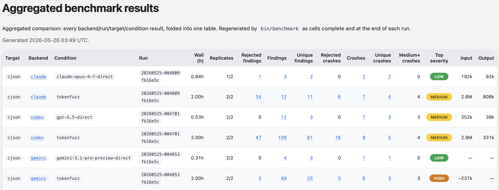

# Benchmark the harness

`bin/benchmark` answers one question with evidence rather than opinion:

> For the same target, backend, and time budget, does the audit harness
> find more **real, reproducible** bugs than a bare "find all
> vulnerabilities" prompt?

You do not need to know the harness internals to run it or read the
result. This page is written for any security team member who can open a
terminal and a browser tab.

## What it does

It runs two **conditions** head-to-head and compares them:

| Condition (`--conditions` token) | Shown on the page as | What it is |
| --- | --- | --- |
| `model-direct` | `<backend>-direct` (e.g. `codex-direct`) | One agent, a bare CTF prompt, no harness scaffolding. The control. |
| `harness` | `tokenfuzz` | `bin/audit` exactly as shipped. |

The `--conditions` flag always takes the stable tokens `model-direct` and
`harness`; the results page labels them with product-facing names — the
baseline after the backend that ran it, the harness as `tokenfuzz`.

Each condition is run multiple times (LLM runs are stochastic, so one
run proves nothing) under an identical wall-clock budget. A crash is
counted **only when an AddressSanitizer report is on disk** — never
because an agent claimed it in prose. That is what makes the number
trustworthy.

## Quick start

```bash
bin/benchmark --target pcre2
```

With all defaults, that command runs:

| Setting | Default | Meaning |
| --- | --- | --- |
| `--backend` | _(see below)_ | Agent backend, one of: `claude`, `codex`, `gemini`, `oss`. |
| `--replicates` | `3` | How many times each condition is run. |
| `--budget-wall` | `7200` | Seconds each run is allowed (120 minutes). |
| `--conditions` | `model-direct,harness` | Both conditions. |
| `--bench-root` | `output/benchmark` | Where all results are stored. |

So `bin/benchmark --target pcre2` is: **the default backend, 3 runs
each of model-direct and harness, 120 minutes per run** — six runs,
about twelve hours of wall-clock. Run `bin/benchmark --help` to see every
option and the exact default backend.

!!! note "Budget for the harness's recon pass"
    `harness` is `bin/audit` exactly as shipped, with one benchmark
    optimization: every harness cell in the same benchmark run shares a
    per-run recon cache keyed on the same target source and backend. The
    first harness cell that sees a target's source typically spends
    10–30 minutes on a breadth-first **recon** pass before deep
    investigation begins; later harness cells normally get a cache hit
    and spend their budget on investigation. A short first harness cell
    can be eaten almost entirely by recon — which is why the default is
    120 minutes. For a meaningful comparison, give each cell well over
    one hour.

!!! tip "Try it first with no API cost"
    `bin/benchmark --target pcre2 --dry-run` runs the whole pipeline
    with synthetic data and no LLM calls. Use it to see the output shape
    before spending a real budget.

## See a live demo

Reproduce the demo run below on each supported backend:

```bash
bin/benchmark --target cjson --backend claude --replicates 2 --budget-wall 7200
bin/benchmark --target cjson --backend codex  --replicates 2 --budget-wall 7200
bin/benchmark --target cjson --backend gemini --replicates 2 --budget-wall 7200
```

[](../assets/benchmark_demo.png){target=_blank title="TokenFuzz vs Model-Direct — click to open full-size"}

Browse the rendered demo here:
<https://tokenfuzz.github.io/tokenfuzz/benchmark-demo/> — open
`FINDING-CLUSTERS.html` to see the per-cluster table, then click any
`FIND-####` link to see the full report and reproducer.

[^1]: These numbers are from an active evaluation; we are still scaling
    up longer runs across more targets and backends. If you can spare
    cycles to contribute a target or replicate a run, please open a PR
    or issue against [tokenfuzz/tokenfuzz](https://github.com/tokenfuzz/tokenfuzz)
    — every additional data point sharpens the comparison.

## Reading the results

Results append to one backend ledger, for example
`output/benchmark/codex/benchmark-results.md`, with a styled
`benchmark-results.html` rendered next to it. The cross-backend
aggregate lives at `output/benchmark/benchmark-result.md` (and `.html`)
and folds in the latest run for each backend/target pair.

Each run adds three blocks in the order you need them:

**Verdict** — one sentence: which condition found the strongest bug,
and the per-condition spread. Read this first.

**Scoreboard** — the headline table. Columns are grouped by *evidence
type* (findings vs. crashes) and a *severity tail* that scores both
conditions on the same scale:

| Column | Meaning |
| --- | --- |
| `Condition` | `tokenfuzz` (the harness) or `<backend>-direct` (the bare baseline). |
| `Replicates` | `done/total`; a `(Nq)` suffix means N replicates hit a provider quota — treat as upper-bounded effort, not a failure. |
| `Wall (h)` | Median per-replicate wall-clock, in decimal hours. |
| `Rejected findings` | FIND reports an independent validator agent threw out (false positives, misreadings, sanitizer-already-catches). Links to `REJECTED-FINDINGS`. |
| `Findings` | FIND reports that survived the validator gate but produced no crash artifact — leads, not yet bugs. |
| `Unique findings` | Findings after `bin/cluster-findings` merges duplicate signatures. Each row in `FINDING-CLUSTERS` is a unique root cause; the `Members` column links every FIND-* report sharing the signature. |
| `Rejected crashes` | Crash directories triage discarded (not reproducible, harness artefact, known issue). Links to `REJECTED-CRASHES`. |
| `Crashes` | Crash directories that survived triage. Reproducible ASan reports with stack frames on disk. |
| `Unique crashes` | Crashes after `bin/cluster-crashes` merges duplicate signatures. |
| `Medium+ crashes` | Unique crashes scored Medium or higher by `bin/reachability`. The headline impact metric — low-severity noise inflates `Crashes` without moving this. |
| `Top severity` | Highest tier observed in the cell (`Low` / `Medium` / `High` / `Critical`, or `—` if nothing triaged). |

!!! note "Why a big crash count can still lose"
    The `<backend>-direct` row is the un-triaged floor — a bare CTF
    prompt with no scaffolding. It often produces *more* raw crashes,
    because nothing filters API-misuse or self-inflicted crashes.
    `tokenfuzz` ships the triage + reachability + reproducer pipeline,
    so its crashes are reach-assessed and bundled. The **severity**
    columns, not the raw crash count, are what the comparison turns on.

**Finding Clusters** (`FINDING-CLUSTERS.html`) — every unique root cause,
sorted strongest-first. The columns mirror the scoreboard's evidence
grouping at the per-cluster level:

| Column | Meaning |
| --- | --- |
| `Severity` | `Critical` / `High` / `Medium` / `Low` / `—`, scored by `bin/reachability`. |
| `Cluster` | Stable id (`FCL-<hash>`) for the root cause. |
| `Size` | Number of FIND reports merged into this cluster. |
| `Class` | Bug family (e.g. `memory-safety`, `dos`, `logic`, `input-validation`). |
| `Strategy` | Which audit strategy (`S5`, `S7`, …) produced the canonical report; `—` for findings from other sources. |
| `Signature kind` | How the signature was derived: `llm` (semantic), `loc` (file:function). |
| `Signature` | The neutral signature string that clustered these reports. |
| `Canonical` | The representative FIND-* (highest severity / smallest id). |
| `Members` | Every FIND-* in the cluster; canonical is **bold**. |
| `Status` | `OK`, or a marker noting why a member was excluded. |

**Bugs by severity** — every distinct crash, sorted strongest-first,
with a `Found by` column and a link to its reproducer bundle.

Every pooled crash — both conditions — is bundled into a `REPORT.md`
+ `REPORT.html` + `reproduce.sh` under
`output/benchmark/<runid>/pool/crashes/`, so you can open any bug and
see exactly why it scored the way it did.

## Common variations

```bash
# More replicates = a more trustworthy result (5+ recommended for claims).
bin/benchmark --target pcre2 --replicates 5

# Give each run 90 minutes instead of the default 120.
bin/benchmark --target pcre2 --budget-wall 5400

# Only run the harness condition (skip the model-direct baseline).
bin/benchmark --target pcre2 --conditions harness

# Pick the agent backend (one of: claude, codex, gemini, oss).
bin/benchmark --target libxml2 --backend <backend>

# Start a fresh ledger (the previous one is archived, not deleted).
bin/benchmark --reset
```

## Things to know

- **Pick a target the harness can crack.** If both conditions score
  zero, the run tells you nothing. `libxml2` is a reliable producer; a
  hardened or already-audited target may not crash inside a two-hour
  budget.
- **Recon eats into the first harness budget.** The first `harness`
  cell for a benchmark run pays the cold-start recon cost for the
  current target source and backend. Later harness cells reuse the
  per-run recon cache via `AUDIT_RECON_CACHE_DIR` and normally start
  investigation sooner. The model-direct condition has no such startup
  cost, which is part of what the budget comparison measures: short
  budgets can favour model-direct, especially on the first harness
  cell.
- **Replication is part of the result.** LLM runs are stochastic. Three
  replicates give you a ranking, not a statistically significant claim
  — use 5+ replicates and more than one target before drawing
  conclusions.
- **Your real audit output is untouched.** Every run is isolated under
  `output/<target>-bench-…/` via `bin/audit --experiment`.
- **Token usage is reported per experiment.** Each ledger section
  includes a **Token usage** table keyed by the cell's `--experiment`
  name, with input, cached-input, output, and prompt-estimate columns.
- **Some backends only estimate cost.** A backend whose CLI reports
  token usage gets real numbers; the `gemini` backend's `agy` CLI does
  not, so its cells show a character-count or prompt-estimate row
  flagged `estimated` in the ledger. Missing Codex/Claude usage is
  treated as unknown/zero, not estimated from error text.
